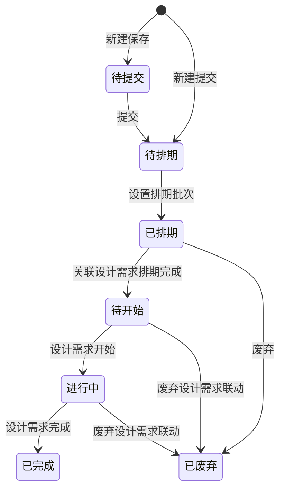

# 优化图文需求-全局说明

### 状态变更

### 状态定义

【状态】枚举在原型中出现「待提交」「待排期」「已排期」「待开始」「进行中」「已完成」「已废弃」
「待提交」为新建保存后的状态，允许编辑并展示「保存」「提交」
「待排期」为提交后等待设置排期批次的状态
「已排期」为已设置排期批次的状态，允许移除排期批次、关联设计需求、新建设计需求和废弃
「待开始」为关联设计需求排期完成后的状态
「进行中」为关联设计需求开始后的状态
「已完成」为关联设计需求完成后的状态
「已废弃」为废弃操作或关联设计需求废弃联动后的状态

### 状态与操作对照

| 状态 | 可执行的操作 | 操作说明 |
| --- | --- | --- |
| 所有状态 | 详情 | 原型存在「详情」入口 |
| 待提交 | 编辑、删除 | 编辑弹窗展示「保存」「提交」 |
| 待排期 | 设置排期批次 | 设置排期批次后自动生成并关联设计需求 |
| 已排期 | 移除排期批次、关联设计需求、新建设计需求、废弃 | 废弃仅允许「已排期」状态 |
| 待开始 | 关联设计需求 | 支持变更设计需求和取消勾选 |
| 进行中 | 关联设计需求 | 支持变更设计需求和取消勾选 |
| 已完成 | - | 原型样例仅展示「详情」 |
| 已废弃 | - | 不展示业务操作 |

### 通用规则

规则：优化图文需求是运营侧发起的图文优化需求，支持手工新建、保存、提交、排期、关联设计需求和废弃。
规则：设置排期批次后，系统自动生成一条设计需求并关联优化图文需求。
规则：优化图文需求可关联多个设计需求，也允许取消关联。
规则：关联设计需求状态变化会联动优化图文需求状态。
规则：删除设计需求时，仅删除设计需求与优化图文需求的关系。
规则：废弃设计需求时，若该设计需求关联的图文需求池关联设计需求数为1，则连带废弃优化图文需求；若大于1，则删除设计需求与优化图文需求的关系。
规则：页面存在下载图标，原型未展开导出字段、范围、文件名或权限规则，不单独创建导出文档。

### 不在范围内

不处理「设计需求管理」完整主流程的独立PRD。
不处理「任务排期」页面、设计任务执行、模板另存为和文件上传组件的独立PRD。

### 待确定项

「待排期」是否允许编辑待确定。
「新建图文优化需求」点击保存后的默认状态是否一定为「待提交」待确定。
删除优化图文需求允许状态和是否物理删除待确定。
导出入口、导出字段和导出范围待确定。
