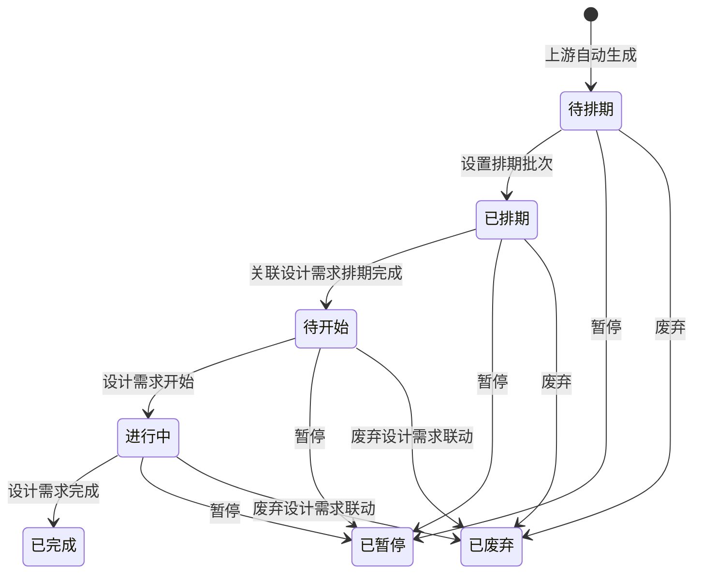

# 图文需求池-全局说明

### 状态变更

### 状态定义

【排期状态】枚举在原型中出现「待排期」「已排期」「待开始」「进行中」「已完成」「已暂停」「已废弃」
【需求类型】枚举在原型中出现「新品」「变更」，生成设计需求时对应为「新品」或「优化」，具体映射以自动生成说明为准
「待排期」为图文需求池自动生成后的初始状态，允许设置排期批次
「已排期」为已填写排期批次的状态，允许移除排期批次、关联设计需求或新建设计需求
「待开始」为关联设计需求排期完成后的状态
「进行中」为关联设计需求开始后的状态
「已完成」为关联设计需求完成后的状态
「已暂停」为用户暂停或上游暂停后的状态，允许重新打开，重新打开后的目标状态待确定
「已废弃」为用户废弃、上游取消或关联设计需求废弃后的状态

### 状态与操作对照

| 状态 | 可执行的操作 | 操作说明 |
| --- | --- | --- |
| 全部状态 | 详情 | 原型仅展示「详情」入口，未展开独立详情页 |
| 待排期 | 设置排期批次、暂停、废弃 | 「废弃」仅在存在「已删除」标签时前端展示，具体标签来源待确定 |
| 已排期 | 移除排期批次、关联设计需求、新建设计需求、按父商品自动创建、暂停、废弃 | 移除排期批次需校验是否已关联设计需求 |
| 待开始 | 关联设计需求、暂停、废弃 | 可执行操作以页面「更多」菜单和状态控制为准，完整权限待确定 |
| 进行中 | 关联设计需求、暂停、废弃 | 可执行操作以页面「更多」菜单和状态控制为准，完整权限待确定 |
| 已完成 | - | 原型样例仅展示详情，不展示业务操作 |
| 已暂停 | 重新打开 | 重新打开后的状态待确定 |
| 已废弃 | - | 原型样例仅展示详情，不展示业务操作 |

### 通用规则

规则：图文需求池支持「按父商品聚合展示」和「MSKU销售国维度」两种列表视图。
规则：按父商品聚合展示时，聚合【父商品编号】+【需求类型】一致的数据合并展示。
规则：当【goods id】变更为停售时，将名下所有销售国数据展示「需求取消」标签。
规则：当用户选择父商品或父商品明细数据时，系统需全部转化为销售国维度数据后再处理。
规则：列表存在「新建设计需求」「按父商品自动创建」「设置排期批次」「移除排期批次」「关联设计需求」「暂停」「废弃」「重新打开」等入口，具体入口展示与状态、标签、关联设计需求关系相关。
规则：页面右上角如存在下载、固定或历史类图标，原型未展开字段、范围、权限或执行规则，不单独创建导出文档。

### 不在范围内

不处理「设计需求管理」完整主流程的独立PRD，仅记录图文需求池触发或联动到设计需求的规则。
不处理「任务排期看板」「模板管理」「上传文件组件」的独立PRD。

### 待确定项

「已暂停」重新打开后的目标状态待确定。
各状态下「暂停」「废弃」「关联设计需求」「新建设计需求」按钮的完整权限和展示条件待确定。
「废弃」仅在存在「已删除」标签时展示，标签来源和后端校验待确定。
列表下载图标是否为导出、导出字段和导出范围待确定。
