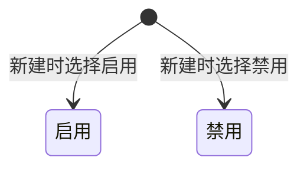

# 模板管理-全局说明

### 状态变更

### 状态定义

【状态】枚举值包括「启用」「禁用」
【模板生成类型】枚举值包括「自动」「手动」，新建弹窗字段名为「模板生成类型」
【处理类型】枚举值包括「自动」「手动」，编辑弹窗和详情弹窗字段名为「处理类型」
【规则优先级】从 1 开始，小的优先排序，默认新建规则的【规则优先级】为 1
【辅料类型】基于当前页面页签预填，页签包含「印刷牛皮纸盒」「贴纸」「彩盒」「说明书」

### 状态与操作对照

| 状态或条件 | 可执行的操作 | 说明 |
| --- | --- | --- |
| 所有状态 | 详情、复制、编辑、删除、配置自动模板 | 列表行展示「详情」「更多」，「更多」下展示「复制」「编辑」「删除」「配置自动模板」 |
| 新建时 | 设置状态 | 「新建辅料设计模板」弹窗展示【状态】，可选「启用」「禁用」 |
| 已有模板 | 独立启用、停用 | 源文件未展示独立启用/停用按钮，是否支持待确定 |

### 通用规则

列表按照【规则优先级】升序展示
字段需要基于【辅料类型】展示不同字段，只有「条码贴纸」展示【销售平台】【目的国】【店铺】
【产品分类】多选级联选择器，查出产品分类，默认增加「全部」选项并置顶
【品牌】多选选择器，查出品牌，默认增加「全部」选项并置顶
【销售平台】多选选择器，查出销售平台，默认增加「全部」选项并置顶
【目的国】多选选择器，联动【销售平台】查询，未选择【销售平台】时选项查不出值，默认增加「全部」选项并置顶
【店铺】多选选择器，联动【销售平台】查询，未选择【销售平台】时选项查不出值，默认增加「全部」选项并置顶
当辅料维度为「sku」时，不展示【销售平台】【目的国】【店铺】，并且【品牌】默认置灰选「全部」
【源文件路径】在说明表中写为「辅料文件路径」，不限制字符类型，字符限制 500 位字符；字段命名最终以系统为准
「上传文件」用于上传【模板图片】，支持格式、大小、数量、是否立即上传待确定
「保存」自定义模板的落库规则、校验规则和成功提示待确定

### 不在范围内

不展开「产品分类」「品牌」「销售平台」「目的国」「店铺」基础数据维护流程
不创建导出文档，源文件仅展示下载图标，未展开导出范围、字段、校验或执行规则
不创建独立启用/停用操作文档，源文件未展示独立启用/停用入口
