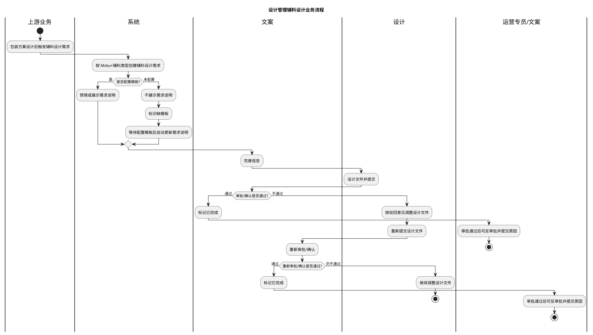
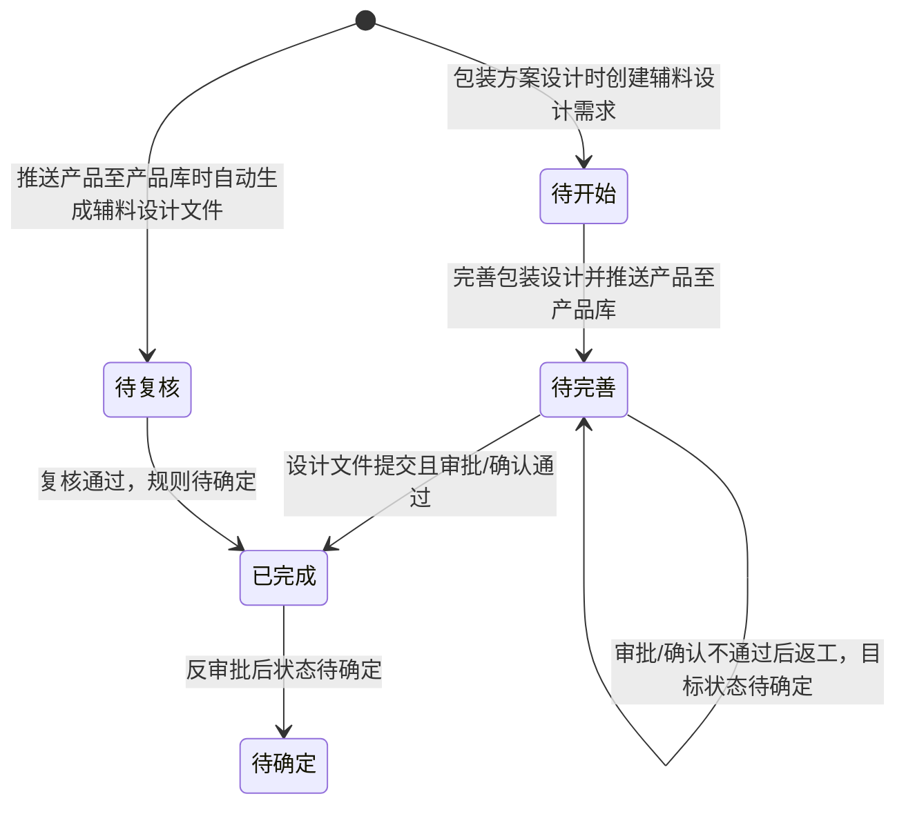

# 设计管理业务流程-全局说明

### 业务范围

本文档基于「业务流程」页面整理设计管理中辅料设计相关的业务流程、角色、状态、上下游联动和待确定点。

页面主要为流程图、旧新逻辑对比、辅料类型说明和模板规则说明，未展开列表字段、详情字段、操作弹窗、提交校验、导出字段或系统执行明细，因此本模块不单独创建查询、操作、导出或系统自动触发文档。

### 流程口径

规则：「业务流程」页面同时出现旧逻辑与新逻辑说明，以下按页面标注的「新逻辑」整理；与流程图中「msku请购」节点存在冲突的触发入口标为待确定。
规则：旧逻辑为运营在 Msku 提交请购单时触发生成辅料设计需求。
规则：新逻辑为在包装方案设计后、打样前触发生成辅料设计需求。
规则：新逻辑下辅料设计需求按「Msku+辅料类型」维度处理，不再按单一 Msku 维度处理。
规则：包装方案设计时创建的辅料设计需求状态为「待开始」。
规则：完善包装设计并推送产品至产品库时，辅料设计需求状态变更为「待完善」，该时刻作为绩效统计的参考时间。
规则：自动生成的辅料设计文件也需要进入辅料设计需求，初始状态为「待复核」，触发时机为推送至产品库。

### 业务流程泳道图

### 角色与职责

| 角色 | 业务职责 | 待确定点 |
| --- | --- | --- |
| 运营专员 | 旧逻辑中在 Msku 请购时触发需求；审批通过后有权限进行反审批并提交原因 | 新逻辑下运营是否仍是流程发起方待确定 |
| 系统 | 创建辅料设计需求、判断模板配置、标识缺模板、配置模板后自动更新需求说明、在推送产品至产品库时触发状态或自动文件进入需求 | 缺模板标识、自动更新范围、重复触发规则待确定 |
| 文案 | 完善信息、参与审批/确认；审批通过后有权限进行反审批并提交原因 | 文案是否为唯一确认人、与审批流审批人的边界待确定 |
| 设计 | 设计文件并提交；审批不通过时按原因调整后重新提交 | 设计提交的字段、附件、校验和版本规则待确定 |
| 开发员 | 非贴纸类由开发员提需求，并展示具体产品信息 | 开发员入口、提需求字段和与包装方案设计节点的关系待确定 |

### 状态变更

### 状态定义

【状态】业务流程页出现「待开始」「待完善」「待复核」「已完成」
【状态】关联的「辅料设计需求」页出现「草稿」「待生成」「待整理」「待设计」「待审批」「已完成」「返工待确认」「已废弃」，与业务流程页状态枚举不一致，最终状态映射待确定
【待开始】包装方案设计时创建辅料设计需求后的状态，页面说明该状态支持「保存」
【待完善】完善包装设计并推送产品至产品库时变更后的状态，绩效统计参考时间取该状态变更时刻；与「待整理」是否同义待确定
【待复核】自动生成的辅料设计文件进入辅料设计需求后的初始状态，触发时机为推送至产品库；与「待审批」或自动生成条码后的状态关系待确定
【已完成】审批/确认通过后的完成状态

### 状态与流程节点对照

| 状态或节点 | 责任角色 | 流程说明 | 下游结果 |
| --- | --- | --- | --- |
| 包装方案设计后 | 上游业务、系统 | 新逻辑下在包装方案设计后、打样前触发生成辅料设计需求 | 创建辅料设计需求，状态为「待开始」 |
| 是否配置模板 | 系统 | 判断当前需求参数是否能配对模板 | 已配置则展示或预填需求说明；未配置则不展示「需求说明」并给出感叹号标识 |
| 配置模板后 | 系统 | 用户配置模板后，系统自动重新更新「需求说明」 | 更新范围、覆盖规则和更新时间待确定 |
| 完善信息 | 文案 | 对辅料需求信息进行完善 | 可进入设计文件处理，具体字段和校验待确定 |
| 设计文件并提交 | 设计 | 设计人员完成文件并提交 | 进入审批/确认，提交字段和附件规则待确定 |
| 审批/确认不通过 | 文案、设计 | 审批不通过后返回设计修改并重新提交 | 驳回原因、目标状态和返工次数规则待确定 |
| 审批/确认通过 | 文案或审批人 | 审批/确认通过后流程完成 | 状态变更为「已完成」 |
| 反审批 | 运营专员、文案 | 审批通过后，运营和文案均可进行反审批并提交原因 | 需要确认返工原因归属，反审批后的目标状态待确定 |

### 辅料类型与处理方式

| 辅料范围 | 维度 | 处理方式 | 说明 |
| --- | --- | --- | --- |
| 条码贴纸 | SKU+FNsku（Msku） | 自动生成 | 贴纸类信息固定、模板固定，理想情况下可全部自动化生成 |
| 品牌条码贴纸 | SKU+FNsku（Msku） | 自动生成为主 | 页面备注「xx+品牌条码贴纸目前需要手动」，具体例外规则待确定 |
| 彩色贴纸 | SKU+FNsku（Msku） | 暂时手动 | 是否后续自动化待确定 |
| 溯源标签贴纸 | SKU+FNsku（Msku） | 手动 | 需要根据包装刀模尺寸变化调整贴纸尺寸 |
| 德法标签贴纸 | SKU+FNsku（Msku） | 手动 | 需要根据包装刀模尺寸变化调整贴纸尺寸 |
| 印刷牛皮纸盒 | SKU | 手动设计或包装设计输出 | 样品未通过时会输出初步刀模图，样品评估通过后可能导致文件变更 |
| 彩盒 | SKU | 手动设计或包装设计输出 | 样品未通过时会输出初步刀模图，样品评估通过后可能导致文件变更 |
| 说明书 | SKU | 处理方式待确定 | 页面标注为可前置处理的辅料类型 |

页面出现的当前辅料组合包括「印刷牛皮纸盒+条码贴纸」「塑封+彩色贴纸」「说明书」「品牌条码贴纸」「条码贴纸」「彩盒+条码贴纸」「扎带+彩色贴纸」「条码贴纸+溯源标签」「塑封+品牌条码贴纸」「空白牛皮纸盒+品牌条码贴纸」「空白白盒+品牌条码贴纸」「内盒设计内容修改」「彩贴设计/修改」「内盒刀模修改」「品牌条码贴纸修改」。

### 模板与需求说明规则

【sku】模板匹配字段，来源待确定
【销售平台】模板匹配字段，来源待确定
【国家】模板匹配字段，来源待确定
【Msku】模板匹配字段，来源待确定
【品牌】辅料设计需求字段，来源于 Msku 或产品信息，取值规则待确定
【销售国家】可多选，多个国家的拆分和模板匹配规则待确定
【辅料需求类型】页面示例包括「说明书」「彩盒」「印刷牛皮纸盒」
【需求说明】有符合条件的模板时展示或预填；没有模板时不展示并给出感叹号标识；配置模板后自动重新更新，是否覆盖人工修改待确定

规则：Msku 需要配对到品牌、销售国家、店铺、辅料需求，不同店铺的辅料内容可能不同。
规则：非贴纸类由开发员提需求，展示具体产品信息；相同 SKU 在不同站点、店铺或平台下设计文件可能不一致。
规则：贴纸类信息固定、模板固定，理想情况下可全部自动化生成。

### 上下游联动

规则：上游「包装方案设计」在打样前触发辅料设计需求创建，旧逻辑「Msku请购」是否仍保留为触发入口待确定。
规则：上游「完善包装设计」并推送产品至产品库时，辅料设计需求状态变更为「待完善」，并作为绩效统计参考时间。
规则：上游推送产品至产品库时，自动生成的辅料设计文件进入辅料设计需求，初始状态为「待复核」。
规则：模板管理配置发生变化后，若原辅料设计需求缺模板，系统需要自动重新更新「需求说明」。
规则：印刷牛皮纸盒、彩盒在样品评估通过后可能发生文件变更；只要辅料设计通过后发生变更，需要在辅料设计需求中预警提示。
规则：辅料任一处修改时，需要保留可选择修改能力；系统重构时希望前端重新拉取需求所需的所有内容、图标和刀模，具体触发范围待确定。
规则：审批通过后运营和文案均可反审批并提交原因；提交时需要确认返工原因归属，后续状态和通知规则待确定。

### 不在范围内

不展开「辅料设计需求」列表、详情、新建、编辑、上传文档、完成、返工等操作文档。
不展开「辅料设计审批」审批详情、催办、撤回、审批条件等操作文档。
不展开「模板管理」的新建、编辑、详情或模板匹配配置文档。
不展开「包装刀模设计」「包装平面设计」「产品库」「产品管理」「开发产品管理」「Msku请购」等上游或下游模块的独立 PRD。
不创建导出文档，业务流程页面未出现导出入口、导出范围或导出字段。

### 主要待确定项

| 待确定项 | 说明 |
| --- | --- |
| 新逻辑触发入口 | 页面流程图出现「msku请购」，说明区写新逻辑为包装方案设计后、打样前触发，最终入口待确定 |
| 状态映射 | 业务流程页的「待开始」「待完善」「待复核」与辅料设计需求页的「草稿」「待生成」「待整理」「待设计」「待审批」映射待确定 |
| 缺模板处理 | 感叹号标识展示位置、配置模板后的自动更新范围、是否覆盖人工修改待确定 |
| 自动生成范围 | 条码贴纸、品牌条码贴纸及其他贴纸类的自动生成条件、例外场景和失败处理待确定 |
| 审批/确认角色 | 文案、运营、审批流审批人之间的确认权限和审批节点待确定 |
| 反审批与返工 | 反审批后的目标状态、返工原因归属、返工次数、消息通知和绩效影响待确定 |
| 文件变更预警 | 样品评估通过后刀模或文件变更如何识别、提醒谁、是否阻断流程待确定 |
| 绩效统计 | 「待完善」时间作为绩效统计参考时间的适用范围和计算规则待确定 |
