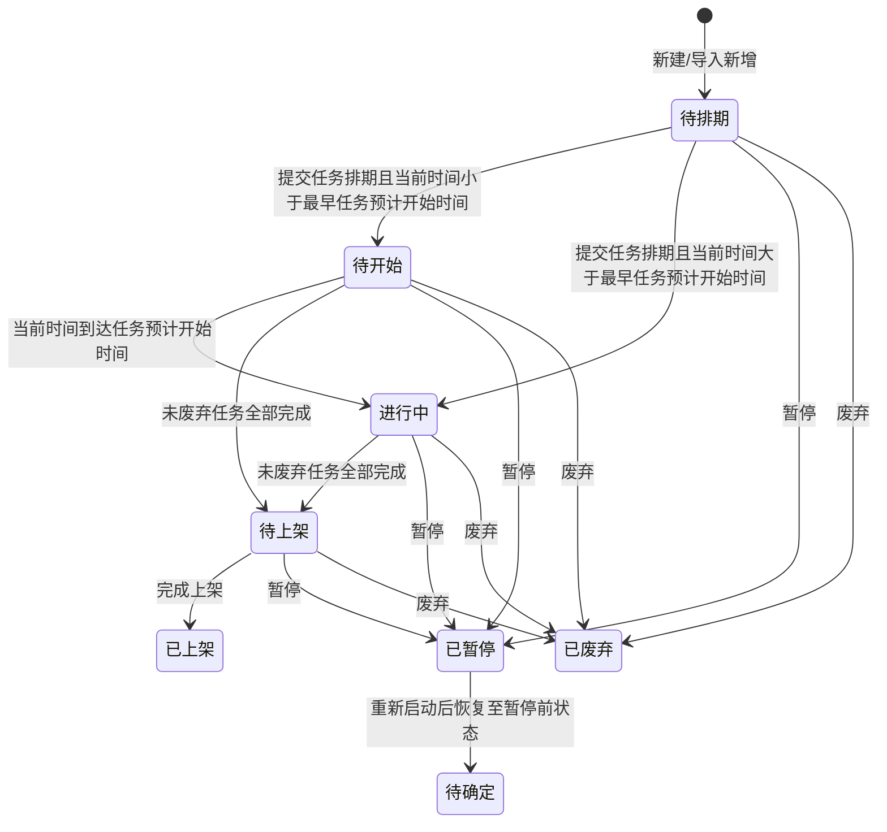
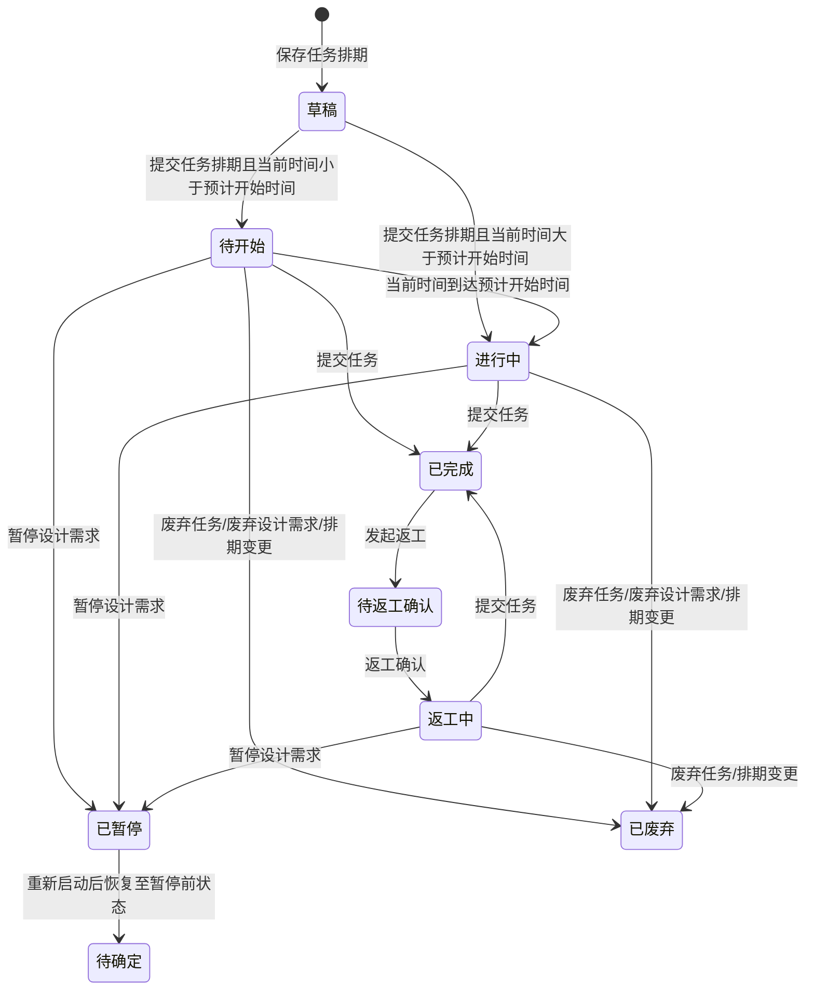

# 设计需求管理-全局说明

### 需求状态变更

### 任务状态变更

### 状态定义

【设计需求状态】原型页签和说明中出现「待排期」「待开始」「进行中」「待上架」「已上架」「已暂停」「已废弃」，样例和组件中还出现「待审批」「待制作」「待评估」「已完成」「已作废」「已逾期」，最终状态枚举待确定
【设计任务状态】原型页签和说明中出现「草稿」「待开始」「进行中」「已完成」「待返工确认」「返工中」「已废弃」「已暂停」，组件中还出现「待审批」「待制作」「待评估」「已作废」「已逾期」，最终状态枚举待确定
【进度状态】按当前时间或实际完成时间与预计结束时间判断，展示「正常」或「已逾期」
【废弃类型】仅在废弃页签展示，可选「排期变更」「废弃需求」

### 设计需求状态与操作对照

| 状态 | 可执行的操作 | 操作说明 |
| --- | --- | --- |
| 所有状态 | 详情 | 查看设计需求详情 |
| 待排期 | 编辑、删除、任务排期、废弃 | 「删除」为真删；任务排期可保存或提交 |
| 待开始 | 编辑、任务排期、暂停、废弃 | 可调整任务排期；暂停时联动未完成任务 |
| 进行中 | 编辑、任务排期、暂停、废弃 | 可调整任务排期；暂停时联动未完成任务 |
| 待上架 | 完成上架、废弃 | 完成上架后记录上架时间 |
| 已暂停 | 重新启动、废弃 | 重新启动后恢复任务暂停前状态 |
| 已废弃 | 详情 | 不展示编辑、排期、暂停、上架等操作 |

### 设计任务状态与操作对照

| 状态 | 可执行的操作 | 操作说明 |
| --- | --- | --- |
| 所有状态 | 详情 | 查看任务详情 |
| 待开始 | 提交、废弃 | 提交后状态变更为「已完成」 |
| 进行中 | 提交、废弃 | 提交后状态变更为「已完成」 |
| 已完成 | 返工 | 发起返工后进入返工确认流程，具体中间状态待确定 |
| 待返工确认 | 返工确认 | 确认后任务状态变更为「返工中」 |
| 返工中 | 提交、废弃 | 重新提交后状态变更为「已完成」 |
| 已废弃 | 详情 | 不展示提交、返工、废弃等操作 |
| 已暂停 | 详情 | 由设计需求暂停联动产生，恢复规则见重新启动设计需求 |
| 草稿 | 详情 | 草稿状态是否可从任务视图提交待确定 |

### 通用规则

规则：设计需求管理包含「需求视图」「任务视图」「任务排期看板」三个入口。
规则：「需求视图」以设计需求为主对象，「任务视图」以设计任务为主对象，「任务排期看板」用于批量查看和调整排期。
规则：「需求视图」列表「全部」页签按创建时间倒序排列，其他页签按更新时间倒序排列。
规则：「任务视图」列表「全部」页签按创建时间倒序排列，其他页签按更新时间倒序排列。
规则：【设计需求编号】字段说明为自动生成，格式为「SJ」+ yymmdd + 三位天序列号，序列号跨日清零，从1开始，例如「SJ240101001」；确认弹窗样例使用「DPJ2024040101」，最终编号前缀待确定。
规则：【任务类型】固定或字典值包含「拿样」「策划」「摄影」「渲染」「设计」；任务视图操作中还出现「文案策划」「摄影准备」「需求确认」「拍摄」，最终任务类型字典待确定。
规则：【负责人】按【任务类型】联动角色人员，拿样取文案角色，策划取文案角色，摄影取摄影角色，渲染取渲染角色，设计取设计角色。
规则：【任务负责人】筛选项取「文案」「摄影」「渲染」「设计」对应人员，并包含停用人员。
规则：任务状态已完成时，【任务类型】【负责人】【预计投入时间】【预计开始时间】【预计结束时间】置灰。
规则：废弃设计需求会联动废弃所有未完成任务，已完成任务不受影响。
规则：暂停设计需求会联动暂停所有未完成任务，已完成任务不受影响。
规则：重新启动设计需求会将已暂停任务恢复至暂停前状态，恢复后的需求状态待确定。
规则：排期变更导致旧任务废弃时，【废弃类型】为「排期变更」；废弃设计需求导致任务废弃时，【废弃类型】为「废弃需求」。
规则：审批入口在原型中出现，但审批触发条件、审批流、审批后状态流转待确定。

### 不在范围内

不处理「图文需求池」「优化图文需求」「模板管理」「辅料设计需求」「辅料设计审批」「设计管理业务流程」的独立 PRD。
不处理菜单中出现但未展开的「包装刀模设计」「包装平面设计」页面。
不定义字典管理、角色管理、业务配置-设计分类分工配置自身的维护规则。
