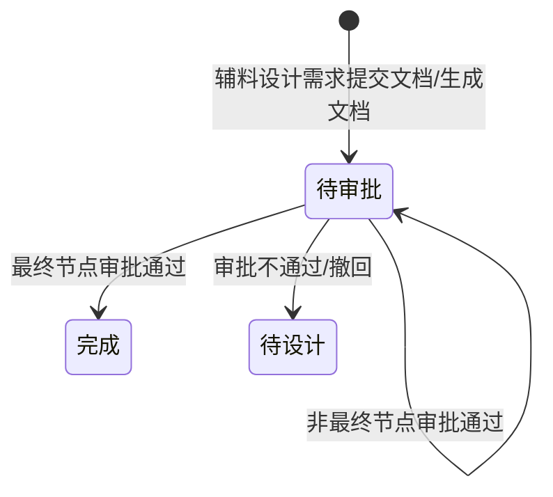

# 辅料设计审批-全局说明

### 状态变更

### 状态定义

【审批状态】枚举在原型中出现「待审批」「完成」
【审批状态】为「待审批」的条件：辅料设计需求进入待审批后创建审批流，且审批流未完成
【审批状态】为「完成」的条件：审批流最终节点审批通过
【审批状态】为「已撤回」的展示方式待确定；原型说明撤回后在审批人的「我审批的」界面直接隐藏该审批单，暂不展示「已撤回」单据

### 审批节点

【节点名称】示例包含「创建审批」「二级审批」
【审批结果】示例包含「审批通过」
【审批人】展示节点处理人
【审批时间】展示节点处理时间
【审批意见】展示审批意见

### 审批标签与条件

【消息通知固定标签】包含「产品名称」「关联维度」「关联编号」「辅料类型」「贴纸类型」
【审批条件】包含「项目编号」「辅料类型」
规则：原型备注希望实现「有项目编号」且【辅料类型】为「说明书」的审批流区别于其他审批流，最终审批流配置规则待确定。

### 指定单据人

【文案】取辅料设计需求的文案
【开品负责人】按关联编号找到SKU，取SKU的开品负责人
【QE】按关联编号找到产品分类，先寻找三级分类对应QE；找不到时继续找二级分类QE；仍找不到时继续找一级分类QE

### 通用规则

规则：辅料设计审批依附于辅料设计需求，不单独维护业务明细。
规则：审批详情展示辅料设计需求的基础信息、需求信息、文件信息、返工明细和审批流程信息。
规则：当审批流已经被第一个审批人审批后，不允许撤回单据，不展示「撤回」按钮。
规则：当审批流尚未被审批时，允许撤回单据，撤回后辅料设计需求状态变更为「待设计」。
规则：「催办」成功后入口展示为「已催办」，重复催办规则待确定。

### 不在范围内

不处理「审批管理」「我发起的」「我审批的」「抄送我的」通用审批列表页面。
不处理审批流配置后台，仅记录本业务的审批条件和指定单据人取值。
