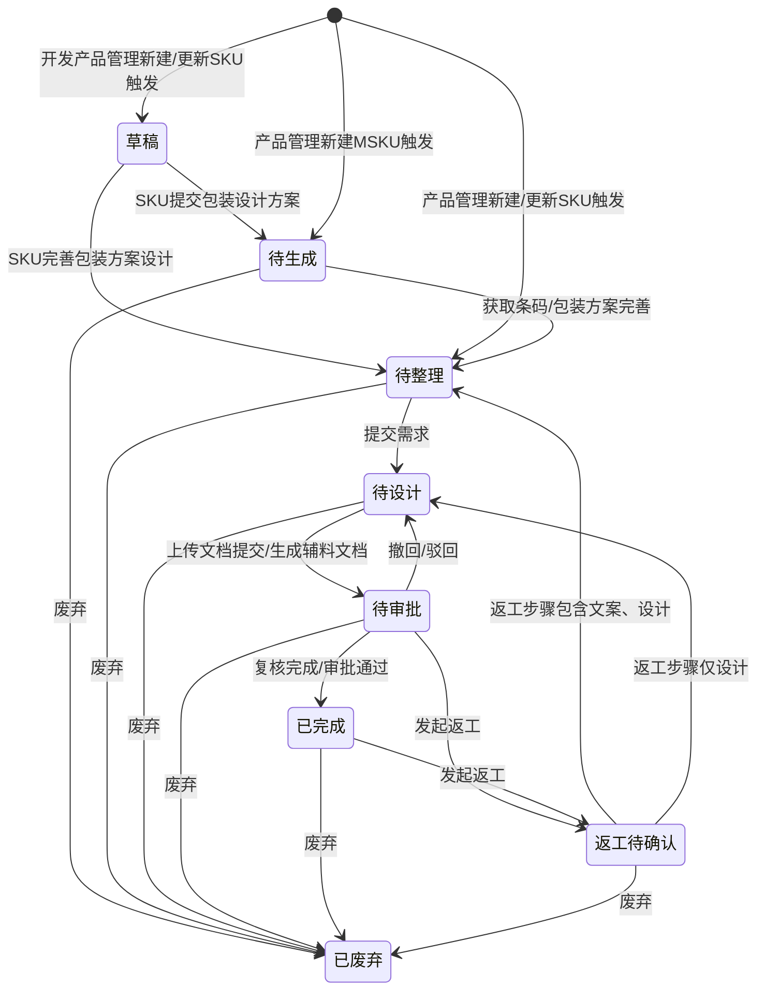

# 辅料设计需求-全局说明

### 状态变更

### 状态定义

【状态】枚举包括「草稿」「待生成」「待整理」「待设计」「待审批」「已完成」「返工待确认」「已废弃」
【状态】为「草稿」的条件：由「开发产品管理」选择「新建辅料设计需求」后自动生成，草稿不在辅料设计需求列表显示，但在SKU关联辅料设计需求时可出现
【状态】为「待生成」的条件：开发SKU提交过包装设计方案后自动进入，或产品管理新建MSKU时生成条码贴纸需求后默认进入
【状态】为「待整理」的条件：SKU进度已完善包装方案设计后自动进入，或产品管理创建/更新SKU触发后默认进入，或MSKU取得条码后由「待生成」自动进入
【状态】为「待设计」的条件：需求信息提交成功后进入，或审批撤回/驳回后回退进入
【状态】为「待审批」的条件：设计上传辅料文档并提交成功后进入，或自动生成辅料文档成功后进入
【状态】为「已完成」的条件：待审批需求复核完成或最终审批通过后进入
【状态】为「返工待确认」的条件：用户在「待审批」或「已完成」状态发起返工后进入
【状态】为「已废弃」的条件：用户按废弃规则确认废弃后进入，废弃后不可恢复

### 状态与操作对照

| 状态 | 可执行的操作 |
| --- | --- |
| 所有状态 | 详情 |
| 待生成 | 编辑、完善信息、废弃、配对模板 |
| 待整理 | 完善信息、提交需求、废弃、分配人员、分配预计初稿交付时间、生成辅料文档、配对模板 |
| 待设计 | 上传辅料文档、提交文档、废弃、分配人员、分配预计初稿交付时间、生成辅料文档、配对模板 |
| 待审批 | 完成、返工、废弃、生成辅料文档 |
| 已完成 | 返工、设置为当前版本、废弃条件按当前版本规则判断 |
| 返工待确认 | 返工确认、废弃 |
| 已废弃 | 详情 |
| 草稿 | 不在辅料设计需求列表展示，可在SKU关联辅料设计需求时出现 |

### 标签规则

【标签】为非独立字段，由系统按需求数据、模板、SKU/MSKU状态自动展示
【标签】展示「缺模板」的条件：辅料设计需求参数无法匹配到模板；更新模板后重新可匹配或首次完善需求后不再展示
【标签】展示「返工中」的条件：返工确认通过后，到需求重新变成「已完成」或「已废弃」前持续展示
【标签】展示「需求取消」的条件：辅料类型为「说明书」且SKU类型为「无说明书」，或辅料类型为「彩盒」且SKU产品包装类型不是「彩盒」，或辅料类型为「印刷牛皮纸盒」且SKU产品包装类型不是「印刷牛皮纸盒」
【标签】展示「产品停用」的条件：关联SKU状态为停用
【标签】展示「产品删除」的条件：关联SKU状态为删除
【标签】展示「商品停售」的条件：关联MSKU状态为「停售」
【标签】展示「商品删除」的条件：关联MSKU已删除

### 通用规则

规则：辅料设计需求支持的【辅料类型】包括「条码贴纸」「说明书」「彩盒」「印刷牛皮纸盒」，原型字段说明写作「产品包装类型」时包含「彩盒」「印刷牛皮纸盒」，最终枚举命名待确定。
规则：【辅料维度】枚举包括「SKU」「Msku」；条码贴纸均为Msku维度，说明书、彩盒、印刷牛皮纸盒为SKU维度。
规则：【辅料需求类型】仅辅料类型为贴纸时展示；当产品包装类型为「彩盒」或「印刷牛皮纸盒」时展示「条码贴纸」，当产品包装类型为其他且品牌为「VT」时展示「彩贴」，其他品牌展示「品牌条码贴纸」。
规则：【处理类型】默认为「手动」，仅配对上自动模板时为「自动」。
规则：「全部」页签基于【创建时间】倒序排列，其他页签基于【更新时间】倒序排列。
规则：【需求编号】自动生成，格式为「FLD+yymmdd+三位天序列号」，序列号跨日清0并从1开始，例如「FLD240101001」。
规则：【需求说明】和【辅料文档路径】若存在符合条件的辅料模板，则在首次完善前自动预填模板信息；首次完善后不再随模板变化调整。
规则：【辅料文档】由设计上传或系统生成，默认为空；鼠标移入支持查看辅料文档历史明细；当返工序号大于等于2时展示小箭头并可查看每次完成时的辅料文档明细。
规则：【返工次数】点击并确认返工后自动加1；当返工序号大于等于1时展示小箭头并可查看每次返工明细。
规则：【是否当前版本】枚举包括「是」「否」，用于判断辅料完成、返工、切换版本时是否推送或移除老系统辅料。

### 不在范围内

不处理「开发产品管理」「产品管理」「MSKU」「模板管理」「项目管理」「老系统」独立页面的PRD。
不处理「业务配置-人员配置」「字典管理」的配置维护页面，仅在本模块记录取值依赖。
