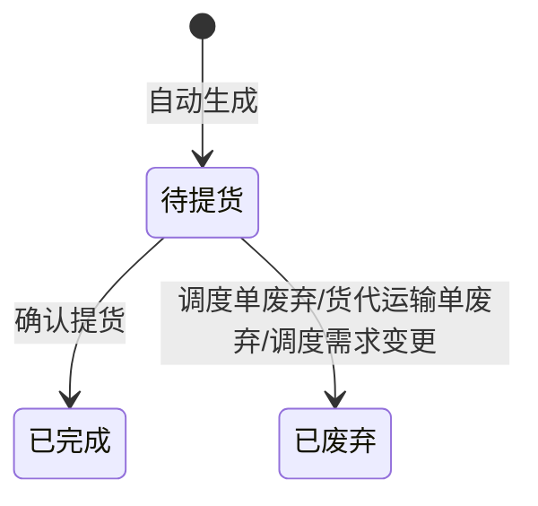

# 仓库提货单-全局说明

### 状态变更

### 状态与操作对照

| 状态 | 可执行的操作 |
| --- | --- |
| 所有状态 | 详情 |
| 「待提货」 | 确认提货、扫码上传、录入日志 |
| 「已完成」 | - |
| 「已废弃」 | - |

### 通用规则

【仓库提货单号】按「GI+YYMMDD+三位序列号」生成
【状态】默认「待提货」
【关联单号】来源为调度单时展示【调度单号】，来源为货代运输单时展示【货代运输单号】，来源为供应商自送单时取值待确定
【提货方提货时间】来源为调度单时取调度需求中最晚的【提货方提货时间】，来源为货代运输单时取调度需求信息的【提货方提货时间】
【总体积(CBM)】按已提货明细汇总
【总重量（KG）】按已提货明细汇总
「录入日志」只有来源单为调度单且关联单号前缀为「DS」时展示
「扫码上传」在「待提货」状态展示，二维码有效性与一次性使用规则见移动端上传文档
