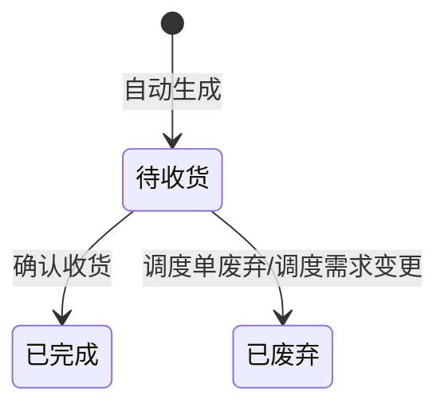

# 仓库收货单-全局说明

### 状态变更

### 状态与操作对照

| 状态 | 可执行的操作 |
| --- | --- |
| 所有状态 | 详情 |
| 「待收货」 | 确认收货、录入日志 |
| 「已完成」 | - |
| 「已废弃」 | - |

### 通用规则

【仓库收货单号】原型说明为「GI+YYMMDD+三位序列号」，与仓库提货单前缀相同，是否应为「GR」待确定
【状态】默认「待收货」
列表示例中出现「待集货」，但字段说明和状态操作说明未定义该状态，待确定
【总体积(CBM)】按已收货明细汇总
【总重量（KG）】按已收货明细汇总
「录入日志」在状态操作说明中出现，但原型未展开弹窗字段和校验，暂不单独成文，规则待确定
