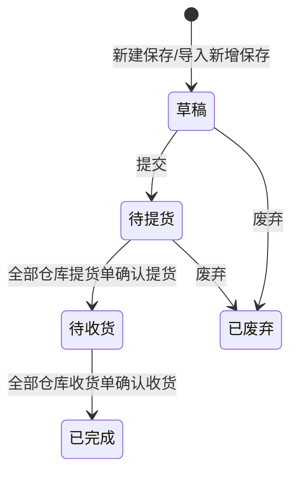

# 调度单-全局说明

### 状态变更

### 状态与操作对照

| 状态 | 可执行的操作 |
| --- | --- |
| 所有状态 | 详情 |
| 「草稿」 | 编辑、废弃、录入调度日志 |
| 「待提货」 | 编辑、废弃、录入调度日志、录入费用 |
| 「待收货」 | 上传POD、录入调度日志、录入费用 |
| 「已完成」 | 上传POD、录入费用 |
| 「已废弃」 | - |

### 通用规则

【调度单号】按「DS+YYMMDD+三位序列号」生成
【调度类型】原型列表可见枚举值为「国内调度」「供应商自送」「货代自提」
【费用状态】默认为空值；当调度单状态为「已完成」且录入/导入实际费用时，费用状态变更为「待申请」
【费用状态】如果在请款池将应付单删除，则回退至「待提交」
【费用状态】如果在请款池将应付单申请，则变更为「申请中」
【费用状态】当请款单付清且请款池已完成时，变更为「已付清」
【司机信息】由【姓名】【身份证】【联系方式】【车牌号】组成
【总体积(CBM)】按调度明细汇总，精度规则待确定
【总重量（KG）】按调度明细汇总，精度规则待确定
【调度日志】在列表点击时打开「调度单详情」并选中「调度日志」页签
「删除」仅出现二次确认文案，缺少状态范围与执行规则，暂不单独成文，规则待确定
