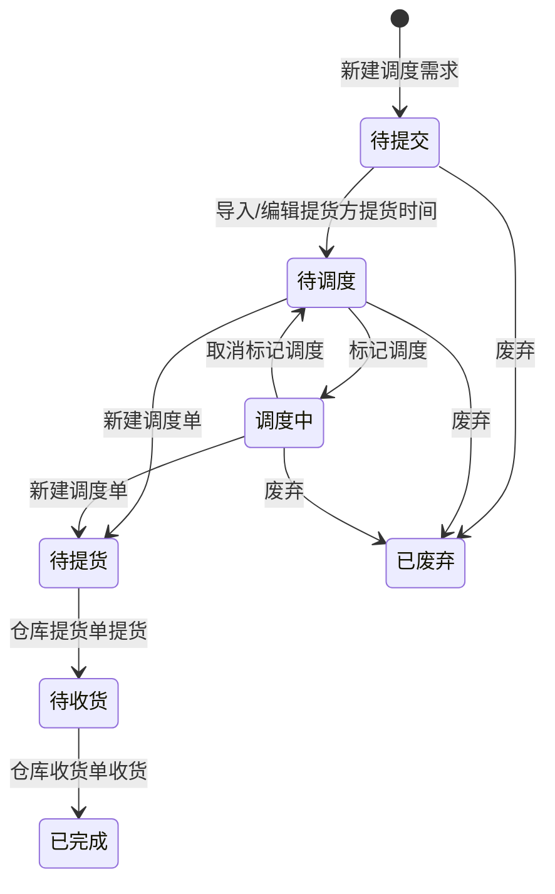

# 调度需求-全局说明

### 状态变更

### 状态与操作对照

| 状态 | 可执行的操作 |
| --- | --- |
| 所有状态 | 详情 |
| 「待提交」 | 编辑、删除、废弃 |
| 「待调度」 | 变更、标记调度、废弃 |
| 「调度中」 | 变更、取消标记调度、废弃 |
| 「待提货」 | 变更 |
| 「待收货」 | - |
| 「已完成」 | - |
| 「已废弃」 | - |

### 通用规则

【调度需求编号】按「SCH+YYMM+四位日序列号」生成，示例「SCH2504010001」
【调度方式】枚举值为「国内调度」「供应商自送」「货代自提」，原型新建说明中展示「国内调度」「供应商自送」，「货代自提」是否支持新建待确定
【提货方类型】原型可见枚举值为「供应商仓」「货代仓」，新建字段说明中仅展示「供应商仓库」
【收货方类型】原型可见枚举值为「供应商仓」「货代仓」，新建字段说明中展示「供应商仓库」
【总体积(CBM)】按明细【箱数】与产品体积汇总，精度规则待确定
【总重量（KG）】按明细【箱数】与整箱重量汇总，精度规则待确定
【箱数】按【调度数】/【装箱数】计算
【调度数】需要满足整箱数，用户填写失焦时若不满足【装箱数】则向上取整
「批量废弃」仅在原型按钮区出现，缺少弹窗、字段与校验细节，暂不单独成文，规则待确定
「调柜单联动逻辑（暂不做）」按原型标识为不在本期范围
