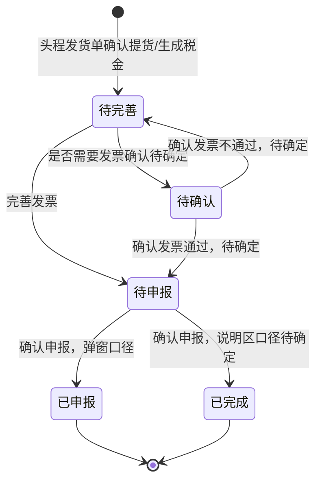

# VAT税金申报-全局说明

### 业务范围

VAT税金申报用于承接头程发货单确认提货后生成的 VAT 申报数据，维护发票信息、确认发票、确认申报、编辑备注、查看日志，并支持导出税金文件和导出申报列表。
本模块来源页面为「VAT税金申报」。
本模块不包含头程发货单提货、业务配置、申报主体配置、VAT申报国家配置、物流费用明细维护和税金附件上传的完整业务规则。

### 状态变更

### 状态与操作对照

| 状态 | 可执行的操作 | 说明 |
| --- | --- | --- |
| 所有状态 | 日志 | 原型列表展示「日志」入口，日志内容、字段和权限待确定 |
| 待完善 | 完善发票、编辑备注 | 完善发票后原型规则写入「待申报」 |
| 待确认 | 确认发票、编辑备注 | 确认发票弹窗支持「通过」「不通过」，后续状态待确定 |
| 待申报 | 确认申报、编辑备注 | 确认申报后弹窗文案写入「已申报」，说明区写入「已完成」 |
| 已申报 | - | 原型列表样例和确认申报弹窗使用「已申报」 |
| 已完成 | - | 原型说明区和状态页签使用「已完成」，是否与「已申报」同义待确定 |

### 状态枚举

【状态】可见枚举包含「待完善」「待确认」「待申报」「已申报」「已完成」
【状态】「已申报」与「已完成」是否为同一终态待确定

### 通用字段规则

【国家】由头程发货单目的国带入，当前自动生成范围可见「英国」「德国」，完整范围通过参数配置，具体配置项待确定
【币种】按【国家】对应币种代码带入，当前可见「GBP」「EUR」
【VAT申报主体】按头程发货单明细【店铺】+【国家】匹配「业务配置-申报主体配置」，展示【公司英文名称】
【店铺】按拆分后的头程发货单明细店铺展示，多个店铺以标签形式展示
【箱数】按拆分后的【实际装柜数】/【装箱数】取值，计算口径待确定
【套数】按拆分后的【实际装柜数】取值，是否应为商品套数待确定
【出库时间】取头程发货单【实际出库时间】
【物流商】取头程发货单费用明细中的物流商
【税金文件】取头程发货单费用明细中报价方式为「税金」的费用项附件
【税率(%)】取「业务配置-财务配置-VAT申报国家配置」中对应国家当时税率
【发票编号】默认为空，通过「完善发票」维护
【发票日期】默认为空，通过「完善发票」维护
【类型】默认为空，通过「完善发票」维护，选项为「递延」「非递延」
【B00税金】默认为空，通过「完善发票」维护
【税金】默认为空，完善发票后按【B00税金】×【税率(%)】自动计算，百分比折算口径待确定
【备注】默认为空，通过「编辑备注」维护
【创建时间】取 VAT税金申报记录创建时间

### 权限与日志

所有操作均需要校验当前用户是否具备对应操作权限；权限点命名待确定。
用户执行「完善发票」「确认发票」「确认申报」「编辑备注」「导出税金文件」「导出列表」后需要记录操作日志；日志字段、日志入口展示内容和是否支持查看操作前后值待确定。

### 不在范围内

不定义头程发货单确认提货、头程发货单费用明细、物流商配置、税金附件上传和费用报价方式维护规则。
不定义「业务配置-申报主体配置」和「业务配置-财务配置-VAT申报国家配置」的配置页面规则。
不定义财务菜单、公共导航、标签页、个人中心、系统设置等公共框架能力。

### 待确定项

「已申报」与「已完成」是否为同一终态待确定；原型列表样例展示「已申报」，说明区和状态页签展示「已完成」。
「待确认」状态的生成条件待确定；原型仅展示页签和「确认发票」操作，未说明如何进入「待确认」。
「确认发票」选择「通过」或「不通过」后的状态流转待确定。
【税金】按【B00税金】×【税率(%)】计算时，税率字段是否需要除以100待确定。
【箱数】和【套数】拆分口径待确定。
日志字段、日志详情页和日志权限待确定。
