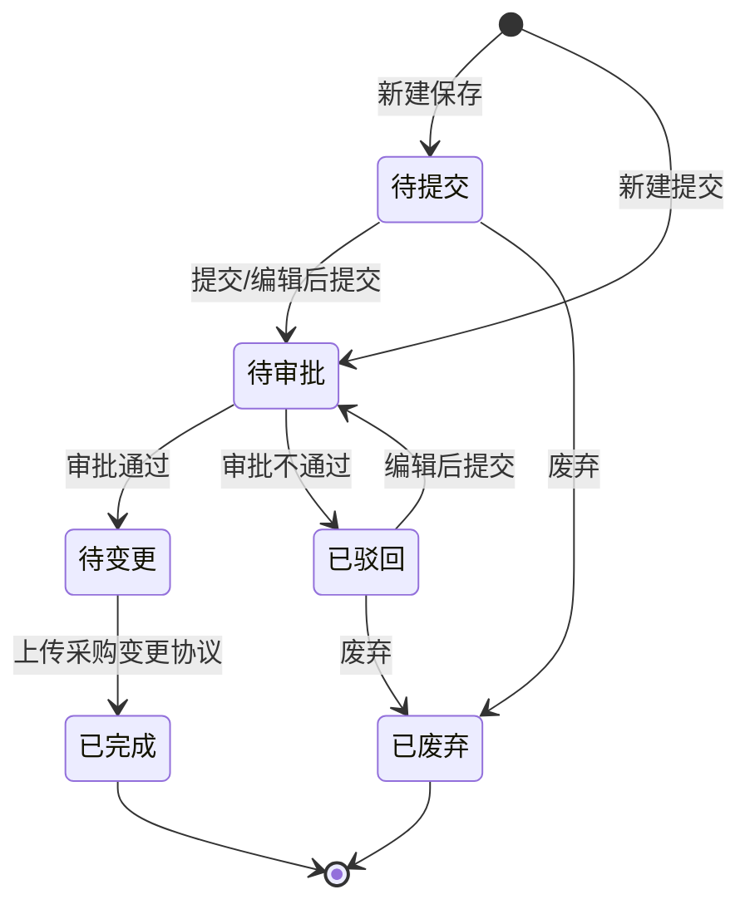

# 成本调整单-全局说明

### 业务范围

「成本调整单」用于在入库后调整入库单相关成本金额，覆盖入库单、入库批次、入库批次关联的下游所有批次、贸易信息表的金额变更。

采购应付单的金额不直接修改，通过成本调整单记录和影响后续请款处理。

### 状态流转

### 状态与操作对照

| 状态 | 可执行的操作 |
| --- | --- |
| 所有状态 | 详情 |
| 待提交 | 编辑、废弃 |
| 待审批 | 审批 |
| 待变更 | 上传变更协议 |
| 已驳回 | 编辑、废弃 |
| 已完成 | - |
| 已废弃 | - |

### 通用规则

【成本调整单号】系统生成，格式为「CA+YYYYMMDD+三位日序列号」
【调整数量】按成本调整单内入库单明细数量统计
【调整完成时间】上传采购变更协议成功时间
【不含税单价调整后】按【含税单价调整后】/（1+【税率】）计算，四舍五入，最多保留两位小数
【含税总金额调整后】系统计算展示，计算口径待确定
成本调整单影响范围包含入库单的金额、入库批次的金额、入库批次关联的下游所有批次的金额、贸易信息表的金额。
成本调整单不直接改采购应付单金额，采购应付单通过成本调整单金额在请款池和新建请款单环节处理。

### 请款池联动

当成本调整单状态为「待提交」「待审批」「待变更」「已驳回」时，关联入库单对应的应付单进入「成本调整中」。
当入库单关联的采购单为现结时，在「请款池-采购单现结」的采购应付单展示标签「成本调整中」。
当入库单关联的采购单为月结时，入库应付单展示标签「成本调整中」，所属页面原型文本待确认。
存在「成本调整中」标签的应付单无法发起请款。
新建请款单时后端需要卡控「成本调整中」数据，提示「存在成本调整中的单据，无法新建请款单」。

### 待确定

审批未开启时，提交成本调整单后的目标状态待确定。
「含税总金额调整后」的字段命名和计算公式待确定，原型示例值与字段名称存在不一致。
月结入库应付单展示「成本调整中」的准确页面待确定，原型文本写作「请款池-采购单现结」。
成本调整单「已完成」或「已废弃」后是否立即释放请款池「成本调整中」标签，以及释放时机待确定。
成本调整单操作权限、数据权限和可见范围待确定。
