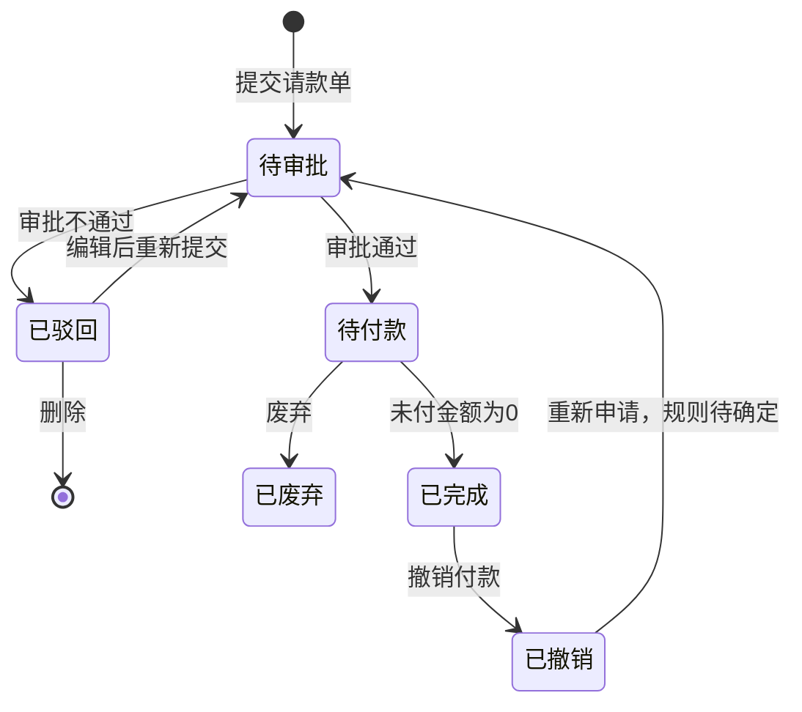

# 请款单管理-全局说明

### 状态变更

### 状态定义

【状态】枚举值包括「待审批」「已驳回」「待付款」「已完成」「已撤销」「已废弃」
【状态】为「待审批」的条件：请款单提交成功后进入审批流，等待审批人处理
【状态】为「已驳回」的条件：审批结果为「不通过」
【状态】为「待付款」的条件：审批结果为「通过」，且未付金额大于0；0元请款单是否直接进入「已完成」待确定
【状态】为「已完成」的条件：请款单未付金额为0
【状态】为「已撤销」的条件：已完成请款单执行「撤销付款」后进入，撤销付款展开规则不在本模块来源页中，待确定
【状态】为「已废弃」的条件：待付款请款单执行「废弃」后进入

### 状态与操作对照

| 状态 | 可执行的操作 |
| --- | --- |
| 所有状态 | 详情、打印 |
| 已驳回 | 编辑、删除 |
| 待审批 | 审批、打印 |
| 待付款 | 付款、废弃、打印 |
| 已完成 | 撤销付款、退款、打印 |
| 已撤销 | 重新申请，规则待确定 |
| 已废弃 | 打印，是否允许其他操作待确定 |

### 通用字段规则

【请款单号】自动生成，原型存在两种口径：「QKD+yymmdd+三位天序列号」与「QKD+YYYYMMDD+两位序列号」，最终编号规则待确定
【付款方】单选选择器，来源为公司主体；采购单、模具采购单场景可由关联单据预填
【收款对象类型】展示，来源请款池；采购单和模具采购单为「供应商」，物流订单为「物流商」
【收款对象】单选选择器或展示，采购单和模具采购单取供应商编号，物流订单取物流商编号
【收款账号名称】单选选择器，展示口径为【收款类型】拼接【收款账户名称】，默认预填供应商或物流商收款账户
【开户行名称】展示，基于选择的收款账户带出
【银行账户】展示，基于选择的收款账户带出
【币种】展示，来源关联单据或费用明细
【申请金额】展示，等于明细【本次申请金额】求和
【抵扣金额】展示，等于明细【本次抵扣金额】求和
【调整金额】展示，等于关联未使用成本调整单对当前应付对象的调整金额求和；不同单据类型的调整范围见新建文档
【应付金额】展示，等于【申请金额】-【抵扣金额】+【调整金额】
【已付金额】展示，来源付款记录累计金额
【未付金额】展示，等于【应付金额】-【已付金额】
【预计付款日期】日期选择器，必填，不允许选择过去日期
【备注】文本输入框，非必填，最多500个字符
【申请人】展示，取提交人
【申请时间】展示，提交时记录；驳回或撤回后再次提交时重新记录申请时间
【付清时间】展示，原型说明为「审批通过后，当已付=0的时间」，结合状态规则推断应为未付金额为0时记录，最终口径待确定

### 通用金额规则

规则：明细【本次申请金额】只能输入正数，小数点最多精确到两位小数；预付请款单为置灰展示时按来源单据金额带出
规则：明细【本次申请金额】不得超过对应明细【未申请金额】
规则：明细【本次抵扣金额】只能输入正数，小数点最多精确到两位小数
规则：明细【本次抵扣金额】不得超过对应明细【未申请金额】
规则：明细【本次抵扣金额】不得超过可用预付余额或抵扣余额；多条明细共享同一供应商余额时，累计抵扣金额不得超过可用余额
规则：采购单、月结、模具采购单存在「填充」入口时，点击后自动带入剩余未申请金额或可抵扣余额；页面初始化是否自动填充以各类型新建文档为准
规则：除费用单以外的请款池类型，原型说明【本次应付金额】不能小于等于0，但提示文案为「序号{1，2，3}的数据本次应付金额不允许<0」，最终是否允许0待确定

### 上下游联动

规则：请款单来源于请款池或关联业务单据，提交后占用对应单据的申请中金额或抵扣余额，具体锁定时点待确定
规则：模具采购请款单提交时如存在预付抵扣，需扣减预付余额；废弃请款单时需回退预付余额
规则：待付款请款单付款后，由财务付款模块更新【已付金额】和【未付金额】；当【未付金额】为0时自动变更为「已完成」
规则：退款相关字段包括【可退款金额】【退款中金额】【已退金额】，来源及计算规则待确定

### 不在范围内

不展开「付款」「撤销付款」「退款」操作：本模块原型仅出现入口或列表操作，付款展开页面归属「财务付款」模块。
不生成「保存请款单」操作文档：请款单新建来源页仅展示「提交」「关闭」和提交确认文案，未出现请款单保存按钮、保存字段或执行规则。
不展开「导入付款记录」「导入水单附件」操作：列表页出现导入相关文案，但字段与执行结果属于付款记录管理，模块边界待确认。

