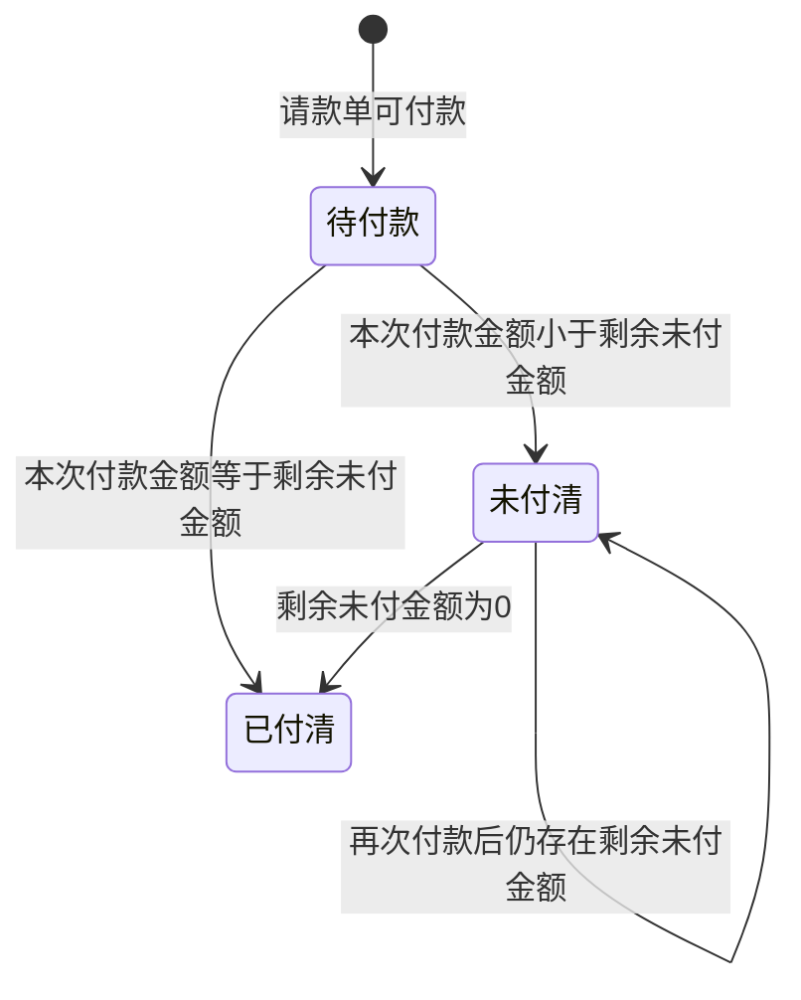

# 财务付款-全局说明

### 业务范围

规则：财务付款承接已生成请款单后的实际付款登记、付款记录生成、已付金额回写和未付金额刷新。
规则：当前模块覆盖「模具采购单」「采购单现结」「预付单」「费用单」「头程发货单」「月结」6类付款页面。
规则：请款池、请款单新建、请款单审批、退款单、预付款资金看板不在本文档范围内，仅在涉及付款联动时记录引用关系。
规则：「调度单」在完整流程资料中出现，但不在本次模块来源页面内，本次不生成调度单付款操作说明。

### 付款主流程

规则：完整流程资料描述为系统按「单据+付款方式」维度生成多个标签页，汇总不同请款内容。
规则：请款单基于请款池数据生成，并可关联回请款池，用于查看采购单、入库单等来源单据的已付金额、未付金额和付款进度。
规则：付款信息包含【付款日期】【付款金额】【付款单位】，在各付款类型页面通过「付款」操作录入。
规则：付款信息提交后是否必须进入审批、审批通过后再更新付款状态，原型流程图有节点但付款弹窗未展开审批配置，待确定。

### 状态变更

### 状态定义

【付款状态】为「待付款」的条件：请款单已进入可付款环节且【应付金额】-【已付金额】大于0，具体触发节点待确定。
【付款状态】为「未付清」的条件：已存在付款记录且【应付金额】-【已付金额】大于0，是否作为请款单状态展示待确定。
【付款状态】为「已付清」的条件：【已付金额】等于【应付金额】且【剩余未付】为0。
【付款状态】枚举是否还包含「付款审批中」「付款驳回」「已取消」待确定。

### 状态与操作对照

| 状态 | 可执行的操作 |
| --- | --- |
| 待付款 | 付款、查看请款信息、查看付款记录 |
| 未付清 | 付款、查看请款信息、查看付款记录 |
| 已付清 | 查看请款信息、查看付款记录 |
| 付款审批中 | 待确定 |

### 付款类型与来源明细

| 付款类型 | 来源页面 | 明细来源 | 典型费用项 |
| --- | --- | --- | --- |
| 模具采购单付款 | 付款-模具采购单 | 模具采购单及其请款明细 | 原型示例为「货款」「计损费」，是否统一为「模具费」待确定 |
| 采购单现结付款 | 付款-采购单现结 | 采购单、费用单、扣款单 | 「货款」「计损费」「扣款」 |
| 预付单付款 | 付款-预付单 | 预付单 | 「预付费」 |
| 费用单付款 | 付款-费用单 | 费用单 | 「计损费」等费用分类 |
| 头程发货单付款 | 付款-头程发货单 | 运单/头程费用明细 | 商检费、THC码头操作费、订舱费、文件费、清关费、关税、海运费等 |
| 月结付款 | 付款-月结 | 入库单、费用单 | 「货款」「计损费」 |

### 通用金额规则

规则：【应付金额】为本次请款单需要实际支付的金额，已扣减本次请款的【抵扣金额】。
规则：【已付金额】为当前请款单历史已完成付款金额汇总。
规则：【剩余未付】=【应付金额】-【已付金额】-当前已确认的【本次付款金额】；页面字段展示口径待确定。
规则：进入付款页面时，页面级【本次付款金额】默认预填剩余未付金额。
规则：点击页面级【本次付款金额】旁「编辑」图标后，【本次付款金额】变为数值输入框。
规则：【本次付款金额】只能输入正数，最多保留2位小数。
规则：【本次付款金额】不得大于【应付金额】-【已付金额】。
规则：页面级【本次付款金额】变更后，按明细行顺序联动填充明细【本次付款金额】。
规则：明细行【本次付款金额】变更后，系统从序号1开始按剩余可付款金额自动补齐后续明细。
规则：明细【本次付款金额】合计应等于付款弹窗内【本次付款金额】。
规则：原型中超额自动回填口径出现【未申请金额】文案，但付款页实际使用应为未付款金额，最终字段口径待确定。

### 通用付款弹窗字段

【应付金额】展示，取付款前页面【应付金额】。
【已付金额】展示，取付款前页面【已付金额】。
【本次付款金额】置灰输入框，取付款前页面和明细合计后的【本次付款金额】。
【实际付款日期】日期选择器，默认空，必填，只允许选择过去日期，是否允许选择当天待确定。
【付款方】置灰输入框，默认取付款前页面【付款方】；在「费用单」「月结」原型中出现「实际付款方」必填文案，最终字段名和是否可编辑待确定。
【付款币种】展示或选择器，默认「CNY」，是否允许切换币种待确定。
【付款备注】文本输入框，默认空，非必填，不限制字符类型，最多500个字符。
【付款水单】附件上传，非必填，不限制文件类型，最多上传3个，支持点击上传、拖拽上传和图片粘贴上传。

### 点击确定时通用校验

校验1：前端校验【本次付款金额】是否为空或小于等于0；不满足提示待确定。
校验2：前端校验【本次付款金额】是否大于【应付金额】-【已付金额】；不满足提示：本次付款金额不能超过未付款金额。
校验3：后端校验【本次付款金额】是否大于【应付金额】-【已付金额】；不满足提示：本次付款金额不能超过未付款金额。
校验4：前端校验【实际付款日期】是否为空；不满足提示待确定。
校验5：前端校验【实际付款日期】是否为未来日期；不满足提示待确定。
校验6：前端校验【付款备注】是否超过500个字符；不满足提示待确定。
校验7：前端校验【付款水单】是否超过3个附件；不满足提示待确定。
校验8：后端校验当前请款单是否仍允许付款；不满足提示待确定。

### 通过校验后通用执行

执行1：保存本次付款主记录，记录【本次付款金额】【实际付款日期】【付款方】【付款币种】【付款备注】【付款水单】。
执行2：保存本次付款明细记录，按来源单据和费用项记录各明细【本次付款金额】。
执行3：累加更新请款单【已付金额】。
执行4：重新计算请款单【剩余未付】。
执行5：当【剩余未付】为0时，将付款状态更新为「已付清」；否则更新为「未付清」，状态字段口径待确定。
执行6：回写来源请款池及来源单据的【实付金额】【未付金额】等付款进度字段。
执行7：新增「付款记录」页签数据，记录付款金额、实际付款日期、付款备注、附件、操作人、操作时间。
执行8：如付款信息需进入审批，则先生成付款审批单并在审批通过后执行金额与状态回写；是否启用该流程待确定。
执行9：记录操作日志。

### 抵扣规则

| 请款池类型 | 预付维度 | 抵扣规则 |
| --- | --- | --- |
| 模具采购单 | 模具采购单 | 可抵扣，只能使用本模具采购单关联预付单的余额 |
| 模具采购单 | 采购单 | 不可抵扣 |
| 采购单 | 模具采购单 | 不可抵扣 |
| 采购单 | 采购单 | 可抵扣，只能使用本采购单关联预付单的余额 |
| 采购单 | 应付对象类型/应付对象 | 可抵扣，需相同应付对象和付款方 |
| 费用单 | 模具采购单 | 不可抵扣 |
| 费用单 | 应付对象类型/应付对象 | 可抵扣，需相同应付对象和付款方 |

### 上下游金额变动规则

| 来源单据 | 场景 | 付款前/后 | 系统处理 |
| --- | --- | --- | --- |
| 采购单 | 采购退货后应付金额仍高于已付款 | 已付款后 | 允许操作，请款池【退货金额】增加，【应付金额】减少 |
| 采购单 | 采购退货后应付金额低于已付款 | 已付款后 | 是否允许待确定；资料提示可能冲入预付费金额 |
| 采购单 | 采购弃货后应付金额仍高于已付款 | 已付款后 | 允许操作，请款池【弃货金额】增加，【应付金额】减少 |
| 采购单 | 采购弃货后应付金额低于已付款 | 已付款后 | 是否允许待确定；资料提示可能冲入预付费金额 |
| 采购单 | 采购变更导致预付比例或货款低于已付款口径 | 已付款后 | 是否允许待确定；资料提示需限制预付不能超过变更前总价 |
| 采购单 | 已付清后采购变更导致总价增加 | 已付款后 | 现结请款池状态从「已付清」刷新为「未付清」，刷新【采购总金额】【货物金额】【其他费用】【未申请金额】【实付金额】【应付金额】 |
| 采购单 | 已付清后采购变更导致总价减少 | 已付款后 | 是否允许待确定；资料提示可能冲入预付费金额 |
| 采购单、模具采购单 | 废弃原始采购单 | 已付款后 | 不允许或处理规则待确定 |
| 采购单 | 采购退货 | 未付款前 | 允许操作，请款池【退货金额】增加，【应付金额】减少 |
| 采购单 | 采购弃货 | 未付款前 | 允许操作，请款池【弃货金额】增加，【应付金额】减少 |
| 采购单 | 采购变更移除付款比例 | 未付款前 | 请款池数据不展示，数据库是否保留待确定 |
| 采购单 | 采购变更货款 | 未付款前 | 刷新请款池【应预付金额】 |
| 采购单、模具采购单 | 废弃原始采购单 | 未付款前 | 请款池数据不展示，数据库是否保留待确定 |

### 不在范围内

不展开请款池生成规则。
不展开请款单新建、提交和审批规则。
不展开付款审批流配置和审批详情字段。
不展开退款单、预付余额调整、供应商扣款单新建规则。
