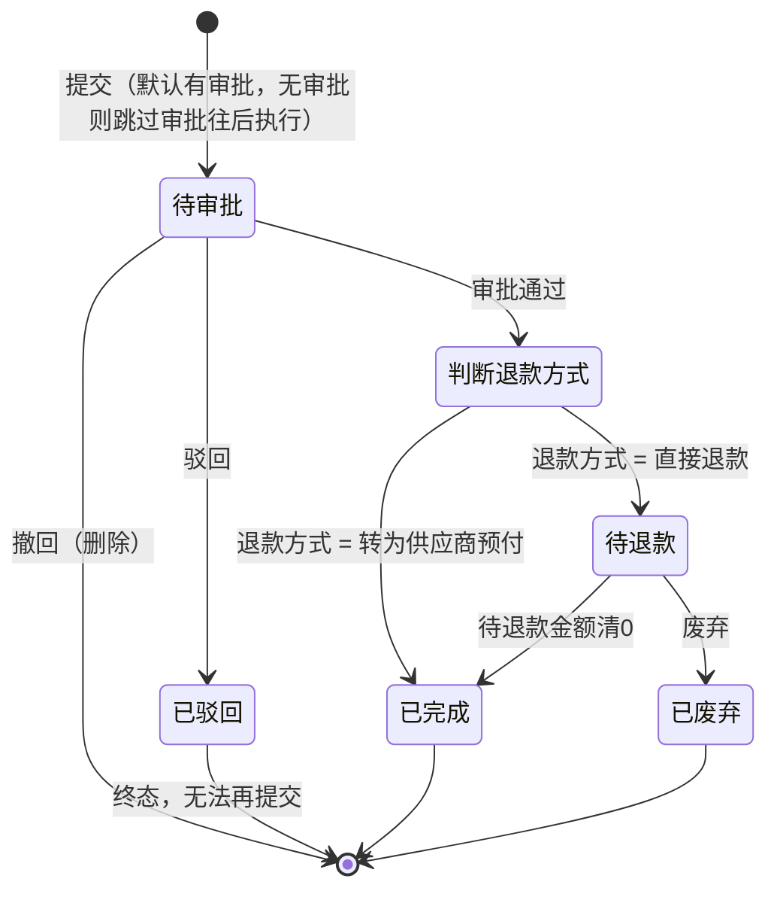

### 状态变更

```mermaid
stateDiagram-v2
    [*] --> 待审批 : 提交（默认有审批，无审批则跳过审批往后执行）
    
    待审批 --> 判断退款方式 : 审批通过
    待审批 --> 已驳回 : 驳回
    待审批 --> [*] : 撤回（删除）
    state 判断退款方式 <<choice>>
    判断退款方式 --> 待退款 : 退款方式 = 直接退款
    判断退款方式 --> 已完成 : 退款方式 = 转为供应商预付
    待退款 --> 已完成 : 待退款金额清0
    待退款 --> 已废弃 : 废弃
    
    已驳回 --> [*] : 终态，无法再提交
    已完成 --> [*]
    已废弃 --> [*]
```

### 状态与操作对照

| 状态   | 可执行的操作 |
| ---- | ------ |
| 所有状态 | 详情     |
| 待审批  | 审批     |
| 已驳回  | 删除     |
| 待退款  | 操作退款   |
|      | 废弃     |
| 已完成  | -      |
| 废弃   | -      |

