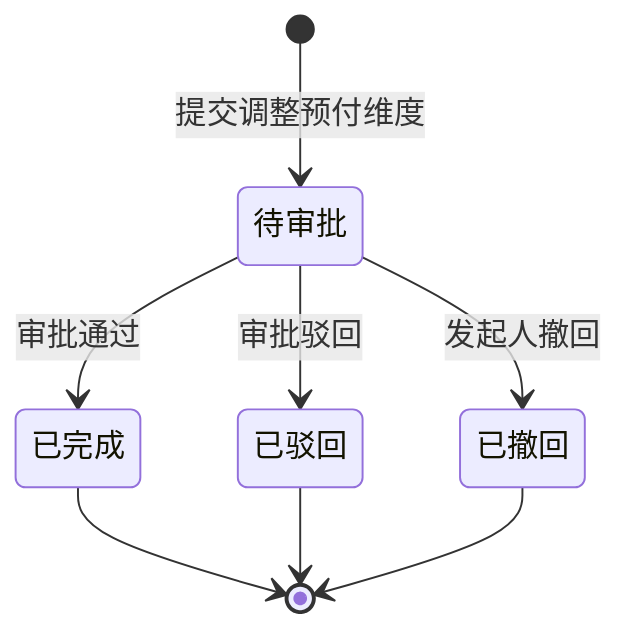

# 预付款资金管理-全局说明

### 业务范围

预付款资金管理用于按预付对象、预付维度、预付单和关联单据查看预付款余额、交易流水和预付维度调整记录。
本模块来源页面包含「预付款资金看板」和「调整预付维度审批详情」。
本模块不包含请款单新建、付款执行、退款、采购对账、供应商扣款单等其他财务对象的业务规则。

### 状态变更

### 状态与操作对照

| 状态 | 可执行的操作 | 说明 |
| --- | --- | --- |
| 全部 | 查看交易流水 | 从余额汇总或余额明细进入交易流水 |
| 全部 | 导出 | 原型展示下载图标，导出范围待确定 |
| 可调整余额 | 调整预付维度 | 仅【预付维度】为采购类且存在预付余额的数据允许发起，具体枚举待确定 |
| 待审批 | 催办 | 在「调整预付维度审批详情」展示「催办」入口 |
| 待审批且未被第一个审批人审批 | 撤回 | 原型备注出现撤回逻辑，入口和适用角色待确定 |
| 已完成 | - | 原型未展示后续操作 |
| 已驳回 | - | 原型未展示后续操作 |
| 已撤回 | - | 原型未展示后续操作 |

### 预付维度规则

【预付对象类型】当前原型样例为「供应商」，其他对象类型待确定
【预付对象】当前原型样例为供应商编码，如「5032」「2309」
【预付维度】可见「采购单」「模具采购单」「供应商」，完整枚举待确定
【付款方】当前原型样例为「一弘科技」，来源待确定
【币种】当前原型样例为「CNY」，完整币种范围待确定
【预付余额】按预付对象、预付维度、关联单号、预付单号、币种汇总交易流水后得出，具体计算口径待确定

### 交易类型

| 类型 | 交易场景 |
| --- | --- |
| 增加 | 预付单付款、模具采购单退回、退货单溢出退回、采购变更单溢出退回、请款单废弃退回 |
| 扣减 | 抵扣采购单、抵扣费用单、抵扣模具采购单 |

### 通用规则

金额字段展示币种维度下的余额和发生额，正数增加、负数扣减。
从「账户余额」点击「查看交易流水」时，系统应带入当前行的预付对象、预付维度、关联单号、预付单号和币种筛选交易流水，具体带入字段以当前行数据维度为准。
发起「调整预付维度」后，在审批未结束前需要锁定对应预付余额；审批驳回或撤回后释放锁定余额。
「调整预付维度」审批通过后需要记录交易流水；交易流水的增加、扣减方向和生成条数待确定。
「调整预付维度审批详情」中消息通知固定标签包含【关联单号】、【预付单号】、【预付对象】、【付款方】、【预付余额】。

### 不在范围内

不定义预付单付款、采购单抵扣、费用单抵扣、模具采购单抵扣等上游业务单据的提交、审批、付款和废弃规则。
不定义钉钉消息模板、钉钉卡片盖章刷新机制和审批消息撤回机制。
不定义财务菜单、公共导航、标签页、个人中心、系统设置等公共框架能力。

### 待确定项

【预付维度】完整枚举、采购类维度的精确值和调整后仅支持「供应商」的原因待确定。
「完成」与「已完成」是否为同一状态待确定；原型审批详情展示「完成」，调整记录展示「已完成」。
撤回规则中原型写到「将扣款单删除，真删」，是否应改为删除预付维度调整单或审批单待确定。
调整预付维度审批流、审批人、审批条件和审批通过后的回写时点待确定。
导出按钮的权限、范围、字段和文件名规则待确定。
