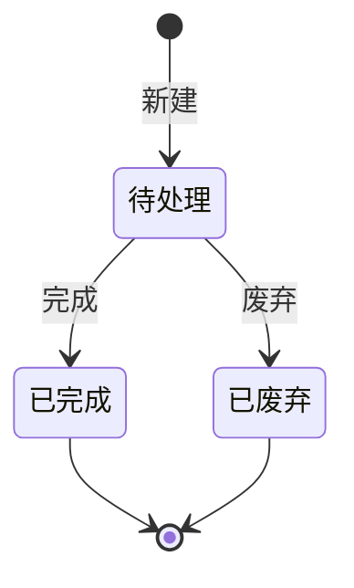

# PRD模板-全局说明-v1.1

### 状态变更

```mermaid
stateDiagram-v2
    [*] --> 待处理 : 新建
    待处理 --> 已完成 : 完成
    待处理 --> 已废弃 : 废弃
    已完成 --> [*]
    已废弃 --> [*]
```

### 状态与操作对照

| 状态 | 可执行的操作 |
| --- | --- |
| 所有状态 | 详情 |
| 待处理 | 编辑、提交、废弃 |
| 已完成 | - |
| 已废弃 | - |

### 通用规则

1. 状态枚举以本页为准
2. 金额/数量字段以明细汇总为准
3. 涉及上下游单据时，需要同步写清楚更新规则
