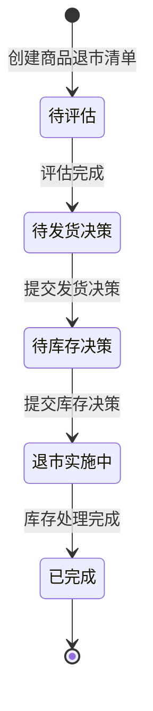

# 商品退市管理-全局说明

### 业务对象

商品退市清单以 MSKU 为处理维度，承接退市商品的评估、发货决策、库存决策及后续库存处理结果。

### 状态变更

评估完成的判断条件待确定：是否要求转单建议、销售亏损、预计计损三项全部提交。
提交发货决策后不存在剩余订单时的状态流转和完成规则待确定。
转单与计损同时存在时，进入「已完成」所需的完成条件待确定。

### 状态与操作对照

| 状态    | 可执行的操作               |
| ----- | -------------------- |
| 所有状态  | 查看详情                 |
| 待评估   | 提交转单建议、更新转单建议、录入销售亏损、录入预计计损 |
| 待发货决策 | 提交发货决策               |
| 待库存决策 | 提交库存决策               |
| 退市实施中 | 查看转单实施、计损实施进度        |
| 已完成   | 查看详情                 |

各角色对清单的查看权限、操作权限及是否允许代办待确定。

### 通用规则

【退市编号】由系统生成，全局唯一，格式为 `EOL + yyMMdd + 三位日序列号`，例如 2026 年 1 月 1 日生成的第一张商品退市清单编号为 `EOL260101001`
【退市编号】日期部分取系统创建日期；三位日序列号每日从 `001` 开始，按创建顺序递增，同一自然日内不得重复
【退市编号】单日序列超过 `999` 时的处理规则待确定
【MSKU】作为商品退市清单处理维度
【退市来源】枚举值为「复盘退市」「变更退市」；来源与两个上游触发场景的对应关系待确定
【状态】枚举值为「待评估」「待发货决策」「待库存决策」「退市实施中」「已完成」
数量字段的单位、精度、是否允许为 0 待确定。
金额字段的币种、精度、汇率日期和换算规则待确定。
商品退市清单创建、评估、决策及实施操作均需记录操作人、操作时间和操作日志。
商品分级何时变更为「清货」或「停售」、是否自动变更以及是否允许人工覆盖待确定。
采购订单剩余数量和库存数量的扣减节点待确定。

### 待确定问题

| 编号  | 待确定问题                    | 建议确认角色      |
| --- | ------------------------ | ----------- |
| Q01 | 退市流程正式触发节点、审批完成节点及审批人    | 运营、业务负责人    |
| Q02 | 两种退市来源的准确枚举名称及映射关系       | 产品、运营       |
| Q03 | 三项评估是否必须全部完成，是否允许退回或重新提交 | 计划、财务 BP、采购 |
| Q04 | 无剩余订单时是否跳过库存决策并直接完成      | 运营、计划       |
| Q05 | 各状态下的数据编辑、撤回、作废和重新打开规则   | 业务负责人       |
| Q06 | 各角色的查看范围、操作权限和消息通知对象     | 业务负责人       |
| Q07 | 商品分级、采购订单和库存数量的联动时点      | 运营、计划、采购    |
