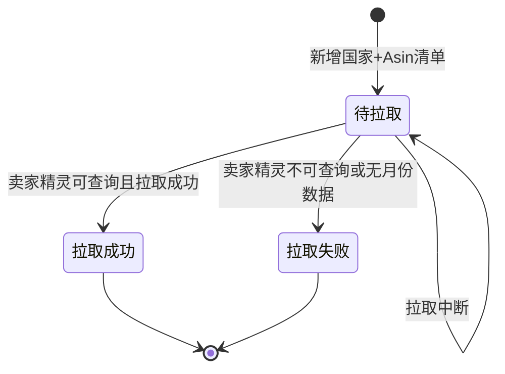

# 市场调研全局说明

### 业务对象

市场调研用于维护国家/站点下的市场分类，并在分类下维护竞品 Asin、Amazon 市场分类、属性配置及拉取数据。

当前源文件中出现的命名：

| 命名 | 出现场景 | 说明 |
| --- | --- | --- |
| 市场调研 | 页面标题、分类列表 | 模块主页面 |
| 市场分析 | 页面标题、竞品列表 | 市场分类下的产品分析/竞品明细页面 |
| 产品分析 | 市场分析页需求描述 | 与「市场分析」的命名关系待确定 |
| 新增细化市场分析 | 新建/编辑分类弹窗标题 | 与「新建调研市场」按钮命名不一致 |
| 新增细化市场分析竞品 | 添加 Asin 弹窗标题 | 与「添加Asin」按钮命名不一致 |

### 状态变更

### 层级与操作对照

| 对象/层级 | 可执行的操作 |
| --- | --- |
| 一级市场分类 | 编辑、删除 |
| 二级市场分类 | 添加Asin、配置、编辑、删除 |
| 市场分析竞品列表 | 添加Asin、移除Asin、修改属性、导入更新属性、拉取Asin、属性配置、导出 |

### 通用规则

【国家/站点】来源为卖家精灵支持的国家列表，建议后端配置。
【Amazon市场分类】来源为 Amazon 分类表。
【负责人】来源为开发员、类目开发经理角色下的启用用户；新建时若登录用户属于以上角色，则默认预填登录用户。
市场分类存在一级、二级层级；源文件未展开更多层级。
一个 Asin 可以存在于多个市场分类中。
数据拉取基于【国家/站点】+【Asin】维度执行，并以【国家/站点】+【Asin】+【月份】作为数据源唯一值，不重复进数据。
删除市场分类不变更原始拉取清单数据和原始拉取数据源。
交接文件只出现入口或按钮、但未展开页面、弹窗、字段、校验或执行规则的功能，不单独创建 PRD 文件。

### 待确定

| 问题 | 当前处理 |
| --- | --- |
| 模块最终命名使用「市场调研」「市场分析」还是「产品分析」 | 待确定 |
| 「配置」按钮是否等同进入「市场分析/产品分析详情」 | 待确定 |
| 月度任务触发时间存在两种口径：每月 26 日 00:05 与每月 21 日 | 待确定 |
| 删除属性项/属性值时，已有属性数据是直接删除还是提示先清除 | 待确定 |
| 一级/二级之外是否支持更多分类层级 | 待确定 |

