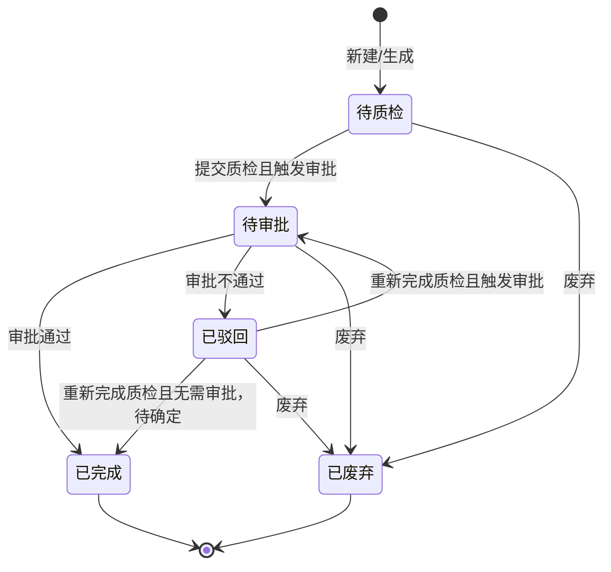
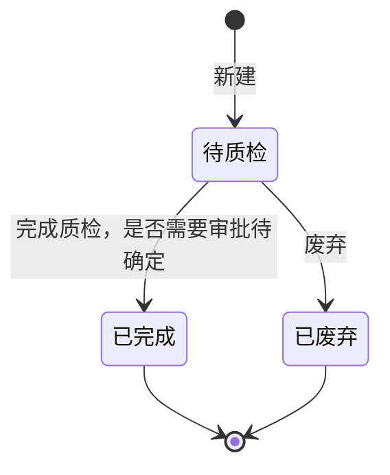

# 质检单-全局说明

### 状态变更
大货质检单

新品质检单

### 状态与操作对照
大货质检单
| 状态 | 可执行的操作 |
| --- | --- |
| 所有状态 | 详情 |
| 待质检 | 质检、修改质检排期、废弃 |
| 已驳回 | 完成质检、修改质检排期、废弃 |
| 待审批 | 审批、废弃 |
| 已完成 | 打印 |
| 已废弃 | - |
新品质检单
| 状态 | 可执行的操作 |
| --- | --- |
| 所有状态 | 详情 |
| 待质检 | 质检、修改质检排期、废弃 |
| 已废弃 | - |
| 已完成 | - |

### 通用规则
【质检单号】大货质检单生成规则为「ZJD」+ 年月日 + 三位天序列号。
【质检单号】新品质检单生成规则为「XZJD」+ 年月日 + 三位天序列号。
【质检类型】大货包含「常规质检」「产品质检」「标签质检」。
【质检类型】「常规质检」来源于调柜单批量手动创建质检单，且生产供应商=出货供应商。
【质检类型】「产品质检」来源于采购单手动创建产品质检单。
【质检类型】「标签质检」来源于调柜单批量手动创建质检单，且生产供应商≠出货供应商。
【质检方式】生成质检单时，基于供应商维度从品质配置中获取并预填；有值则预填，无值则不预填。
【验货模式】生成质检单时，从供应商配置取值。
【QA】大货质检单生成时，基于供应商维度从品质配置中获取并预填；有值则预填，无值则不预填。
【QE】大货质检单生成时，基于供应商维度从品质配置中获取并预填；有值则预填，无值则不预填。
【质检员】新品质检单默认从供应商质检配置取值，支持在质检单列表二次修改。
【货好时间周数】按【货好时间】计算，周范围为周一至周日；当前年份中 1 月 1 日所在周范围为第一周，后续日期按周顺延。
【验货批次】当验货批次有值时，批次数自动等于该验货批次内所有未废弃质检单数量。
【批次已质检数/批次数】当验货批次有值时，已质检数自动等于该验货批次内状态为「已完成」的质检单数量。
【预计质检时间】默认为空，可通过「质检排期」修改。
【提交质检时间】记录质检单首次提交时间，驳回后再次提交不更新。
【完成质检时间】质检单状态变为「已完成」的时间。
【质检结果】完成质检并审批通过后的质检结果。
【处理结果】完成质检且质检结果为「NG」触发审批时，由审批人填写；若未触发审批或审批未填写，则为空。
标签质检单提交时，将库存锁定在质检单中；审批驳回、撤回时，将库存释放为可用库存。

### 待确定
新品质检单完成质检后是否进入审批流，原型中有「新品质检单审核」弹窗入口，但状态说明未完整展开，待确定。
质检单初始状态、各来源单据自动生成质检单的触发条件，待确定。
