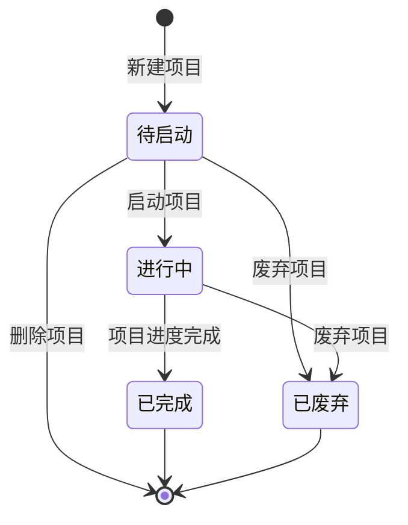

# 项目管理-全局说明

### 状态变更

### 状态与操作对照

| 状态 | 可执行的操作 |
| --- | --- |
| 所有状态 | 复制、详情 |
| 待启动 | 启动、编辑、废弃、删除 |
| 进行中 | 变更项目、编辑、废弃 |
| 已完成 | - |
| 已废弃 | - |

### 状态说明

项目状态包含「待启动」「进行中」「已完成」「已废弃」。

进度任务状态包含「待开始」「进行中」「已完成」「提前完成」「已逾期」「逾期完成」。

列表进度状态包含「正常」「逾期」。

项目类型原型中明确出现「自研」「改款」「通货」。流程图中还出现「拓产品」「拓变体」「拓渠道」，是否纳入本功能的项目类型枚举待确定。

### 通用规则

「详情」进入项目详情页，详情页包含「基础信息」和「项目进度」两个页签。

「复制」仅在原型中出现入口和状态范围，复制字段、复制后状态、是否复制项目进度与关联产品待确定，不单独创建 PRD。

项目人员字段按项目内人员信息取值，不直接等同系统角色表；编辑负责人时使用项目人员信息中的角色和人员。

涉及按 SKU/MSKU 判断项目进度的节点，需要剔除已停用的 MSKU。

项目相关日志在列表展示数量，在项目详情进度页展示日志明细。
