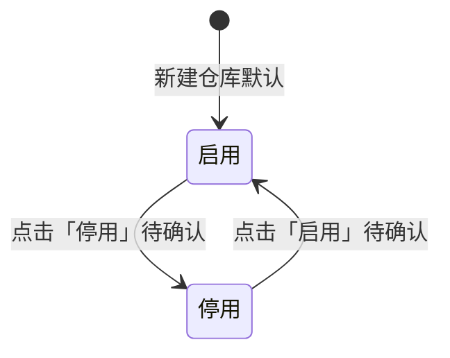

# 仓库管理-全局说明

### 状态变更

### 状态与操作对照

| 状态 | 可执行的操作 |
| --- | --- |
| 所有状态 | 查看 |
| 启用 | 编辑、停用待确认 |
| 停用 | 启用待确认 |

### 通用规则

当前产出范围为「仓库管理」模块，以两个「仓库管理-自营仓」原型中可确认的「自营仓」列表、新建仓库、编辑仓库、查看仓库能力为准。
原型存在「自营仓」「三方仓」「平台仓」「供应商仓」等页签，正式稿还出现「供应商仓/货代仓」「FBA」「WFS」「FBT」「FBN」「亚马逊」等入口或状态，是否纳入本期仓库管理范围待确认。
「新建仓库」「编辑仓库」「查看仓库」均通过「弹窗」动态面板展示，点击「确定」提交或关闭弹窗，点击「取消」关闭弹窗。
原型弹窗字段名为「仓库代码」，原型说明和查看弹窗字段名为「仓库编号」，本文统一写为【仓库编号】，最终命名待确认。
【仓库编号】由系统自动生成，自营仓基于「YH+三位序列号」生成，三方仓基于「YHOW+三位序列号」生成。
【仓库类型】选项包括「FBA仓」「WFS仓」「自营仓」「三方仓」，新建时基于当前页签预填，编辑时不可修改。
【状态】默认「启用」，状态枚举至少包括「启用」「停用」；待定稿仅露出「启用」，正式稿其他列表露出「停用」，状态完整范围待确认。
【第一装货港】按发货仓映射，浙江仓默认「NINGBO,CHINA」，东莞仓/深圳仓默认「YANTIAN,CHINA」，青岛仓默认「QINGDAO,CHINA」。
【离境口岸】按发货仓映射，深圳仓/东莞仓默认「深圳」，浙江仓默认「宁波」，青岛仓默认「青岛」，该字段可编辑。
列表默认按【创建时间】倒序排列。
列表空值展示为「-」。
原型未露出「导出」入口，当前不生成导出需求。
原型未露出「配置仓库」入口，当前不生成配置仓库需求。

### 待确认

正式稿新建/编辑弹窗和操作说明包含【FBA目的地范围】或【FBA目的仓范围】，待定稿未包含，是否适用于「自营仓」待确认。
正式稿新建/编辑弹窗包含【SMP目的地范围】，但待定稿和操作说明未展开，字段是否保留、控件类型、是否必填待确认。
待定稿列表行内操作仅显示「查看」，正式稿自营仓列表显示「编辑」「查看」，是否允许自营仓编辑待确认。
正式稿其他列表行内操作显示「启用」「停用」，待定稿未露出，启用停用是否适用于自营仓待确认。
