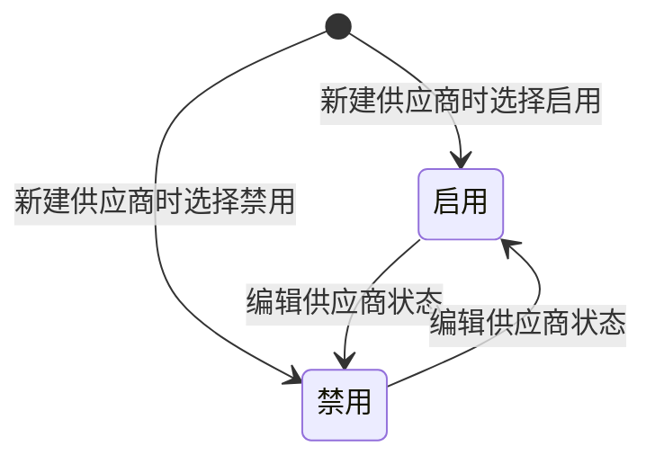

# 供应商管理-全局说明

### 状态变更

### 状态与操作对照

| 状态 | 可执行的操作 | 说明 |
| --- | --- | --- |
| 所有状态 | 详情 | 原型列表操作说明明确所有状态可查看详情 |
| 启用、禁用 | 编辑 | 原型列表「更多」菜单展示「编辑」，具体状态限制待确认 |
| 启用、禁用 | 新建供货关系 | 原型列表「更多」菜单展示入口；供货关系不属于本次供应商管理 PRD 生成范围 |

### 通用规则

供应商状态枚举为「启用」「禁用」。
供应商列表筛选项【状态】默认选中「启用」。
供应商详情为只读展示，不允许在详情页直接修改字段。
列表【供货产品数】统计关联的启用供货产品数量，点击后新窗口跳转至「供货关系列表」并自动筛选当前供应商；供货关系列表规则不在本次范围内。
【装柜供应商】仅允许选择「启用」的供应商代码；未选择时，装柜供应商默认为当前供应商自己。
供应商编号由系统在新建时自动生成，编辑时不可修改。
采购配置中【采购主体】+【币种】不允许重复。
采购配置中【默认值】只能有一条记录为默认值。
收款账户中【默认收款】只能有一条记录为默认收款，默认值记录被删除后自动选择第一条记录为默认值。
联系人信息中【默认联系人】只能有一条记录为默认联系人，默认值记录被删除后自动选择第一条记录为默认值。

### 不在范围内

不生成「报价单」PRD。
不生成「供货关系」PRD。
不生成「新建供货关系」操作 PRD，仅记录为供应商列表中的外部入口。
原型未确认供应商删除入口，本次不生成供应商删除操作 PRD。
未发现供应商管理页面跳转到独立「供应商装货信息」页面的入口，本次不读取和生成独立供应商装货信息 PRD。
