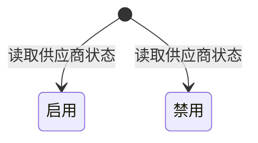

# 供应商装货信息-全局说明

### 业务范围

「供应商装货信息」用于查看供应商主档中的装货与发货相关信息，供采购、发货计划、头程、入库等流程选择或引用供应商装货地址、装货联系人、装货联系电话、唛头格式、采购员和供应商状态。

当前原型仅展示「供应商装货信息」列表、筛选、重置、刷新、导出和列表字段说明；未展示本模块内的新建、编辑、删除、启用、禁用弹窗或二次确认流程。

在「供应商管理」原型中存在「装货信息」维护区，包含装货联系人、装货联系人号码、装货地址等字段；「供应商装货信息」是否只读引用供应商主档维护结果待确认。

### 状态变更

### 状态与操作对照

| 状态 | 可执行的操作 |
| --- | --- |
| 所有状态 | 查看列表、重置筛选、刷新列表、导出 |
| 启用 | 状态变更入口待确认 |
| 禁用 | 状态变更入口待确认 |

### 通用规则

【供应商编号】用于唯一识别供应商，当前页面作为列表字段和筛选项展示
【供应商名称】需要字段权限控制；无字段权限时列表和导出不展示值
【装货详细地址】当前列表按完整地址展示；导出时需要按省市区和详细地址拆分，具体拆分字段以导出文档为准
【装货联系人】取供应商装货信息中的联系人，字段来源是否直接取供应商主档待确认
【装货联系电话】取供应商装货信息中的联系电话，字段来源是否直接取供应商主档待确认
【唛头格式】用于采购发货、装柜或入库前识别货物标识格式，取值规则待确认
【采购员】展示负责该供应商或该装货信息的采购员，取值是否来自供应商主档待确认
【供应商状态】枚举为「启用」「禁用」
【默认装货信息】当前页面未展示默认标识；是否支持一个供应商配置默认装货地址或默认装货联系人待确认

### 上下游联动

采购流程引用供应商装货信息时，仅应选择或展示状态为「启用」的供应商装货信息；是否允许查看或引用「禁用」状态待确认。

发货计划、头程和入库流程引用装货信息时，应带出【供应商编号】、【供应商名称】、【装货详细地址】、【装货联系人】、【装货联系电话】、【唛头格式】；具体引用节点和是否快照保存待确认。

当供应商主档中的装货信息变更后，已生成采购单、发货计划、头程单、入库单是否同步更新待确认。

### 不在范围内

不在本模块展开「供应商管理」的新建、编辑、审批、联系人信息、银行信息、合同信息等本体功能。

不支持根据当前原型新增「新建装货信息」「编辑装货信息」「删除装货信息」文档；相关入口未在本页面展开，待产品确认后补充。
