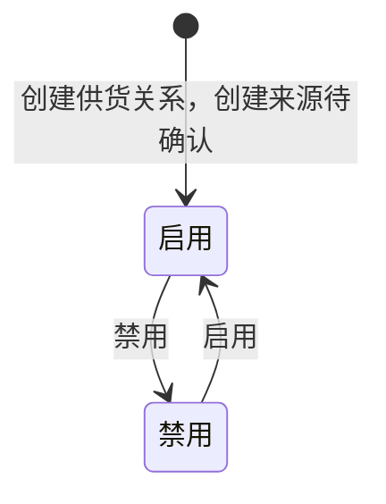

# 供货关系管理-全局说明

### 业务范围

供货关系管理用于查看产品 SKU 或物料 SKU 与供应商之间的供货关系，页面包含「产品」「物料」两个视图。
入口：从「采购」菜单下「供应商管理」分组进入「供货关系管理」。
本模块只覆盖供货关系列表、详情、价格日志、启用、禁用、导出；「供应商管理」本体、「报价单」本体不在本模块范围。
原型中出现「编辑」「删除」「新建报价单」入口，但未展开页面、弹窗、字段、校验或执行规则；其中「编辑」在操作说明中为划线状态，暂不作为已确认可执行操作。

### 状态变更

### 状态与操作对照

| 状态 | 可执行的操作 | 说明 |
| --- | --- | --- |
| 所有状态 | 详情、价格日志 | 「价格日志」只查看审批通过的价格日志 |
| 启用 | 禁用 | 确认后将供货关系状态变为「禁用」 |
| 禁用 | 启用 | 确认后将供货关系状态变为「启用」 |

### 通用规则

【供货类型】枚举「产品」「物料」，默认展示「产品」视图
【状态】枚举「启用」「禁用」
唯一关系按【SKU】+【供应商】+【采购主体】+【币种】作为唯一值
【创建时间】列表按创建时间倒序排列
【供应商编号】引用供应商信息，供应商名称是否在列表或详情同步展示待确认
【采购主体】为供货关系维度字段，取值来源待确认
【采购员】取自供应商信息或供货关系绑定信息，最终来源待确认
【采购交期】取自供应商信息或供货关系绑定信息，最终来源待确认
【原币转本币汇率】在创建时间时取财务上个月月末的浮动汇率
【不含税单价（本币）】按【不含税单价（原币）】×【原币转本币汇率】计算
【含税单价（本币）】按【含税单价（原币）】×【原币转本币汇率】计算
【含税单价（原币）】与【税率】、【不含税单价（原币）】之间的计算规则原型未明确，待确认
价格信息与报价单或审批通过的价格日志存在关联，当前供货关系取价规则待确认
当用户点击「产品」页签时，展示产品供货关系列表和产品筛选项。
当用户点击「物料」页签时，展示物料供货关系列表和物料筛选项。
「重置」只重置当前页签下的筛选条件，不切换页签。
导出只下载当前列表数据，不导出详情弹窗或价格日志弹窗内容。

### 不在范围内

不生成「供应商管理」模块 PRD。
不生成「报价单」模块 PRD。
不支持根据本原型补写新建供货关系表单，原型未展示新建入口、字段和校验规则。
不支持根据本原型补写编辑供货关系表单，原型操作说明中「编辑」为划线状态且未展开字段和规则。
不支持根据本原型补写删除供货关系完整规则，原型仅出现「删除」菜单项，未展开二次确认、校验或执行规则。
不支持根据本原型补写「新建报价单」规则，该入口属于报价单模块且未在本模块展开。
