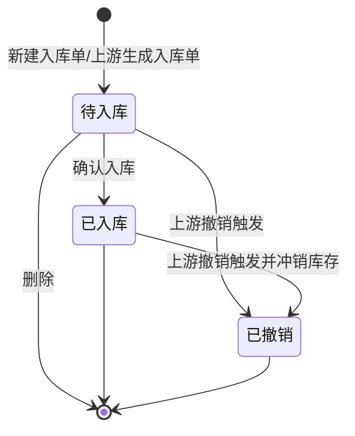

# 入库单-全局说明

### 业务范围

入库单用于记录商品、SKU、Msku、物料进入指定仓库的业务单据，覆盖手动新建的「其他入库」、从质检单生成的「质检入库」、从调拨单生成的「调拨入库」。

入库单确认入库后，系统基于入库明细生成批次流水和库存流水，并增加对应仓库库存。

入库单撤销不在列表支持单独撤销；原型说明为通过调柜子单移除调柜单明细并连带废弃质检单时，系统连带撤销入库单并生成撤销出库流水。

### 状态变更

### 状态与操作对照

| 状态 | 可执行的操作 |
| --- | --- |
| 所有状态 | 详情 |
| 待入库 | 编辑、确认入库、删除 |
| 已入库 | - |
| 已撤销 | - |

### 通用规则

【状态】枚举为「待入库」「已入库」「已撤销」
【入库类型】枚举为「质检入库」「调拨入库」「其他入库」
【入库类型】为「质检入库」时，入库单来源于质检单，具体生成节点待确认
【入库类型】为「调拨入库」时，入库单来源于调拨单，具体生成节点待确认
【入库类型】为「其他入库」时，入库单由用户手动新建，原型仅展示该手动选项
【采购单号】在列表中作为来源单据字段展示；调拨入库、质检入库是否统一复用【采购单号】字段或改为【来源单号】待确认
【入库仓库】确认入库后作为库存增加的目标仓库
【入库数量】以明细行数量为准，确认入库时逐行生成库存影响
【批次】确认入库时生成批次流水，批次号生成规则、批次属性、是否允许同 SKU 多批次待确认
【不含税单价】基于【含税单价】/（1+【税率】）自动计算
【总含税金额(原币)】按明细【含税单价】×【入库数量】汇总，具体四舍五入规则待确认
【原币转本币汇率】取采购单汇率
【总含税金额(本币)】按【总含税金额(原币)】×【原币转本币汇率】计算
确认入库弹窗文案展示「确认后状态将变为已完成」，列表状态枚举展示为「已入库」，本文按「已入库」落地，弹窗文案需待确认统一
删除为「真删」，仅用于「待入库」状态，删除后不保留业务单据状态
已入库单据不支持编辑、删除、确认入库
已撤销单据不支持编辑、删除、确认入库

