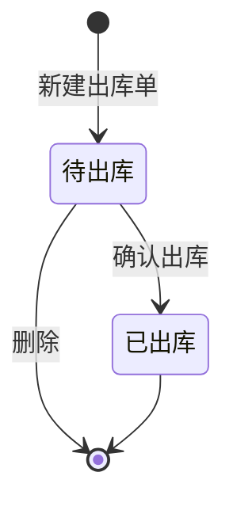

# 出库单-全局说明

### 状态变更

### 状态与操作对照

| 状态 | 可执行的操作 |
| --- | --- |
| 所有状态 | 详情 |
| 待出库 | 编辑、确认出库、删除 |
| 已出库 | - |
| 待审批 | 原型列表示例出现该状态，状态说明未展开，待确认 |

### 出库类型枚举

| 出库类型 | 生成来源/适用场景 |
| --- | --- |
| 调拨出库 | 从调拨单生成；从调柜单生成调拨单+出库单且发往三方仓时使用 |
| 其他出库 | 手动新建出库单时用户选择，原型显示当前仅有该选项 |
| FBA出库 | 从调柜单生成出库单且发往 FBA 仓时使用 |
| WFS出库 | 从调柜单生成出库单且发往 WFS 仓时使用 |

### 通用规则

出库单列表默认按照【创建时间】倒序展示。
【出库单号】自动生成，格式为 `CKD+yymmdd+三位天序列号`，序列号跨日清 0，从 1 开始，例如 `CKD240101001`、`CKD240102001`。
【出库仓库】新建时必填，按自营仓选择；列表筛选支持按出库仓库查询。
【出库类型】新建时必填，手动新建仅支持「其他出库」；系统生成类出库类型按来源单据与目的仓库类型确定。
【来源单据】列表原型未展示独立字段，详情页存在「关联单据」页签但未展开，来源单据编号、来源单据类型、回写规则待确认。
【目的仓库】列表筛选中存在该项，列表字段与详情字段未展示，取值范围和是否必填待确认。
【批次】原型未展示批次字段，是否按批次选择、校验和扣减库存待确认。
【出库数量】以明细行【出库量】汇总为准。
确认出库时需要判断可用库存是否充足；库存不足时提示「可用库存不足，无法出库」。
确认出库通过后扣减库存，并将状态从「待出库」变更为「已出库」。
确认出库弹窗文案写明「确认后状态将变为已完成」，状态说明写明变更为「已出库」，本 PRD 按状态说明「已出库」处理，弹窗文案需待确认。
删除出库单为真删，删除后无法恢复。
撤销出库单弹窗在原型中存在，但列表入口、适用状态、撤销后状态和库存回滚规则待确认。

