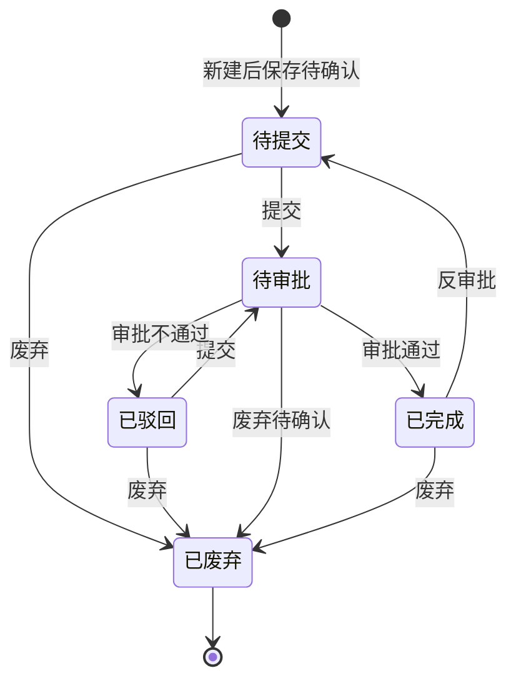

# 合同模板管理-全局说明

### 业务对象

合同模板用于维护采购业务生成采购合同时引用的模板内容，原型入口为「采购」-「采购管理」-「合同模板管理」。
合同模板当前原型覆盖「采购单」「模具采购单」两类应用单据。
合同模板内容由基础信息、交货说明、合同条款组成，其中交货说明和合同条款为富文本内容。

### 状态变更

### 状态与操作对照

| 状态 | 可执行的操作 |
| --- | --- |
| 所有状态 | 详情、复制 |
| 待提交 | 编辑、提交、废弃 |
| 已驳回 | 编辑、提交、废弃 |
| 待审批 | 审批、废弃待确认 |
| 已完成 | 废弃、反审批 |
| 已废弃 | 除通用操作外无其他操作 |

### 通用规则

【合同模板id】由系统自动生成，生成规则为「HT+三位序列号」，序列号自增1，示例「HT001」「HT009」
【合同模板名称】列表字段名称，弹窗字段名称显示为【采购模板名称】，两者是否统一命名待确认
【状态】列表中表示审批流状态，枚举为「待提交」「已驳回」「待审批」「已完成」「已废弃」
【状态】弹窗和详情中示例值为「启用」，表示启用状态还是审批状态待确认；如表示启用状态，是否存在「禁用」枚举待确认
【设为默认模板】枚举为「是」「否」；所有合同模板中仅允许一个模板为默认模板，当某模板设为「是」时，其他合同模板需自动变更为「否」
【应用单据】枚举为「采购单」「模具采购单」
【关联供应商】当前仅在列表展示数量，原型未展开供应商关联入口、关联范围、取消关联规则，待确认
【交货说明】富文本内容用于合同生成，生成合同时需要保留富文本效果
【合同条款】富文本内容用于合同生成，生成合同时需要保留富文本效果
采购订单生成采购合同时确定当时引用的合同模板，后续合同模板变更不影响已在采购单生成的采购合同
原型未展示【适用主体】【适用供应商】【采购场景】【模板类型】独立字段，是否需要补充待确认
原型未展示附件上传、模板文件上传、预览按钮和删除按钮；页面顶部存在无文字「download」图标，具体是否为导出或下载模板待确认

### 不在范围内

不支持凭空补充上传文件、预览模板、适用主体、适用供应商、采购场景字段
不支持删除合同模板，当前原型仅展示「废弃」操作
