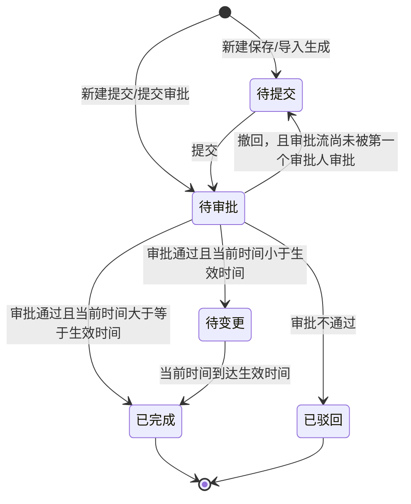

# 报价单-全局说明

### 业务范围

本目录仅描述「报价单」业务对象，覆盖「报价单」列表、新建编辑、提交审批、审批、导入、导出、价格日志和价格生效触发。

「供应商管理」和「供货关系管理」仅作为报价单取值、校验、回写对象出现，不在本目录展开其模块 PRD。

### 状态变更

### 状态与操作对照

| 状态 | 可执行的操作 |
| --- | --- |
| 所有状态 | 详情 |
| 待提交 | 编辑、提交审批 |
| 待审批 | 审批、撤回，撤回入口待确认 |
| 待变更 | - |
| 已完成 | 价格日志 |
| 已驳回 | - |

### 编号规则

【报价单号】系统自动生成，格式为「BJD+yymmdd+三位日序列号」

### 通用规则

【报价单】主数据包含【报价单号】【供应商编号】【报价产品数】【附件】【备注】【生效时间类型】【预计生效时间】【实际生效时间】【创建人】【创建时间】【状态】
【报价明细】以【供应商编号】+【SKU】+【币种】+【采购主体】作为价格变更校验维度
【生效时间类型】枚举值为「下单时间」「入库时间」
【报价类型】由系统计算，枚举值为「新品」「涨价」「降价」
【变更比例】由系统计算，计算公式为（【变更后含税单价】-【变更前含税单价】）/【变更前含税单价】
【变更后单价】由系统计算，计算公式为【变更后含税单价】/（1+【变更后税率】）
【变更后税率】基于【供应商】+【采购主体】+【币种】预填供应商维护数据，原型标注不允许修改
审批通过后，若当前时间小于【生效时间】，单据进入「待变更」；若当前时间大于等于【生效时间】，单据进入「已完成」
报价变更完成后，才将价格应用至供货关系；按【供应商】+【SKU】+【币种】+【采购主体】维度判断，供货关系不存在则新增，存在则更新
供货关系的字段写入范围、历史价格保留策略、更新失败重试策略待确认

### 不在范围内

不生成「供应商管理」模块 PRD
不生成「供货关系管理」模块 PRD
不展开采购配置维护规则
