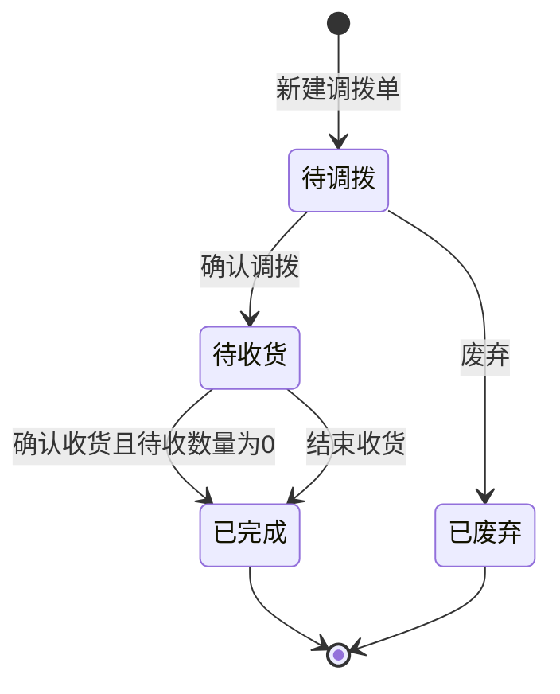

# 调拨单-全局说明

### 状态变更

### 状态与操作对照

| 状态 | 可执行的操作 | 说明 |
| --- | --- | --- |
| 所有状态 | 详情 | 从列表点击「详情」进入「调拨单详情」 |
| 待调拨 | 确认调拨、删除、废弃、详情 | 原型说明「确认调拨」「删除」在发货仓与目的仓为自营仓时展示，三方仓时不展示 |
| 待收货 | 确认收货、结束收货、详情 | 确认收货按本次收货量生成调拨入库单，结束收货直接完成调拨单 |
| 已完成 | 详情 | 不支持继续调拨、收货、废弃、删除 |
| 已废弃 | 详情 | 原型未在列表筛选中展示「已废弃」，是否支持筛选待确认 |
| 待审批 | 详情 | 列表样例出现「待审批」，但状态操作说明未定义该状态流转，是否保留审批流待确认 |

### 通用规则

【调拨单号】调拨单主键编号，按 `DBD+yymmdd+三位天序列号` 自动生成，序列号跨日清0，从1开始，例如 `DBD240101001`、`DBD240102001`
【出库仓库】调拨货物的发出仓库，新建时必填
【入库仓库】调拨货物的接收仓库，新建时必填，受【出库仓库】联动限制
【调拨数量】以调拨明细行汇总为准
【已收数量】以确认收货累计入库数量汇总为准
【待收数量】按【调拨数量】-【已收数量】计算，不允许小于0
【批次】页面未展示批次号输入或列表字段；确认调拨生成出库单时，单价、税率、含税单价按批次取值；确认收货生成入库单时，单价、税率、含税单价从出库单按先进先出取值，具体批次展示与落库方式待确认
【备注】新建主表备注必填，明细备注非必填，最多500个字符
状态枚举以本文件为准；若后续确认存在审批流，需补充「待审批」的入口、可执行操作和状态流转
库存影响以确认调拨和确认收货为准；确认调拨扣减【出库仓库】库存并生成调拨出库单，确认收货增加【入库仓库】库存并生成调拨入库单
涉及三方仓的自动三方仓入库单、三方仓出库单在原型中只出现在废弃联动说明，创建时机和状态流转待确认

### 不在范围内

不支持跨模块重写库存清单、出库单、入库单的完整 PRD，仅记录调拨单对上下游单据和库存的影响
不支持新增原型未展示的审批流程、批次选择弹窗、导入功能和打印功能
