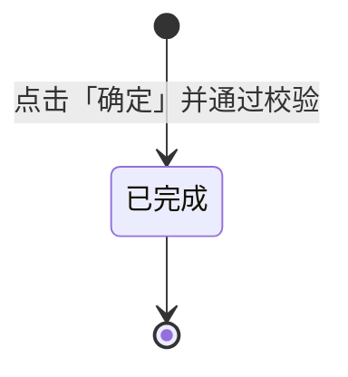

# 调整单-全局说明

### 业务范围

调整单用于在库存管理中对仓库内已有商品库存执行数量调整或换标调整。数量调整用于直接增减指定商品 Msku 的可用库存；换标调整用于在同一仓库、同一商品 SKU 下，将原 Msku/标签库存转换为新 Msku/标签库存。

本模块包含「调整单列表」「调整单详情」「新建数量调整单」「编辑数量调整单」「新建换标调整单」「编辑换标调整单」「库存调整自动触发」「调整单列表导出」。

原型未展示独立「提交」「作废」「删除」入口；列表中存在「更多」操作但未展开具体菜单项，是否包含编辑、作废或其他操作待确认，本版本不单独定义作废调整单操作。

原型未展示【批次】字段；若库存按批次管理，【批次】选择、锁定、扣减和换标后的批次继承规则待确认。

### 业务对象

【调整单】由基础信息和明细信息组成，基础信息包含【调整单号】【仓库】【调整类型】【状态】【备注】【创建人】【创建时间】；明细信息按调整类型区分数量调整明细和换标调整明细。

【数量调整明细】用于记录指定仓库、商品、Msku 的可用库存增减结果，核心字段包含【品名】【sku】【Msku/条码】【销售平台】【发货国】【店铺】【产品库存可用量】【调整量】。

【换标调整明细】用于记录同一商品从原 Msku/标签转换到新 Msku/标签的库存变化，核心字段包含【品名】【sku】【原Msku/条码】【原销售平台】【原发货国】【原店铺】【新Msku/条码】【新销售平台】【新发货国】【新店铺】【装箱数】【产品库存可用量】【换标量】。

### 单号规则

【调整单号】由系统自动生成，规则为 `TZD+yymmdd+三位天序列号`，三位序列号按自然日从 001 开始递增。原型说明中存在 `HBD240101001` 示例，与列表样例 `TZD240101001` 和规则前缀不一致，单号前缀以 `TZD` 为准，最终前缀待确认。

### 调整类型

| 调整类型 | 原型文案 | 适用场景 | 库存影响 |
| --- | --- | --- | --- |
| 数量调整 | 「新建数量调整单」；列表样例存在「盘点调整」 | 对仓库内指定商品 Msku 的可用库存进行增加或减少 | 【调整量】为正数时增加可用库存，为负数时减少可用库存 |
| 换标调整 | 「新建换标调整单」「换标调整」 | 将同一仓库内同一 SKU 的原 Msku/标签库存转换为新 Msku/标签库存 | 原 Msku 可用库存减少，新 Msku 可用库存增加，商品总量不变 |

「数量调整」与列表样例「盘点调整」是否为同一调整类型待确认。

### 状态说明

| 状态 | 说明 |
| --- | --- |
| 已完成 | 调整单已生成并完成库存影响；原型详情页展示状态为「已完成」 |
| 待确认 | 原型未展示草稿、待确认、已作废等状态，是否存在更多状态待确认 |

### 状态流转

### 状态与操作对照

| 状态 | 可执行操作 | 说明 |
| --- | --- | --- |
| 已完成 | 详情、导出 | 可查看详情；列表可通过下载图标导出 |
| 待确认 | 更多菜单 | 原型列表显示「更多」但未展开菜单项，具体操作待确认 |

### 通用业务规则

【仓库】为调整单生效仓库，新建/编辑时必填；选择仓库后才允许添加商品。

【仓库】变更时，如果已存在调整明细，系统清空已有明细，需要用户重新添加商品。

【备注】为新建/编辑页面必填项，最多 500 个字符；原型字段说明允许任意字符。

【商品】通过「添加商品」弹窗选择，弹窗根据已选【仓库】查询该仓库中存在库存的 SKU/Msku，支持多选后带入调整明细。

【产品库存可用量】取库存列表中当前仓库、商品、Msku 对应的可用库存数量，用于前端限制和后端再次校验。

【调整量】用于数量调整，可为正数或负数，必须为非 0 整数；正数增加库存，负数减少库存，负数最小值不得小于当前可用库存的相反数。

【换标量】用于换标调整，必须为正整数，不得大于原 Msku 的【产品库存可用量】。

系统在点击「确定」时必须进行后端库存校验；若可用库存不足，提示「可用库存量不足」，不生成调整单，不触发库存变更。

调整单生成后触发库存调整，调整结果和库存流水需要可追溯到【调整单号】；库存流水字段和日志字段待确认。

### 原型差异与待确认项

【调整单号】列表表头显示为「换标单号」，但页面为「调整单」且字段说明为「调整单号」，本 PRD 统一使用【调整单号】，表头文案待确认。

【批次】原型中未出现，若系统需要按批次调整库存，需要补充批次选择、批次库存校验和换标后批次承接规则。

【编辑入口】原型页面标题包含「新建/编辑」，但列表未展示明确编辑按钮；编辑入口、可编辑状态和编辑后库存差异处理待确认。

【作废入口】原型未展示作废按钮或作废弹窗，本版本不定义作废流程；若后续确认存在作废，需要补充作废后的库存回滚规则。
