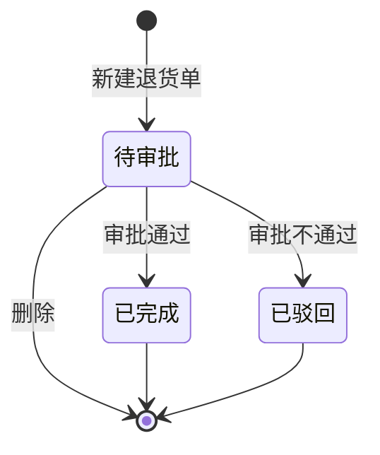

# 退货单-全局说明

### 业务范围

退货单用于记录采购入库后向供应商退回商品的业务单据，原型菜单名称为「采购退货单」，列表页面标题为「退货单」。
退货来源支持从「退货单」列表点击「新建退货单」创建；原型备注提到也可能从「采购单」点击「退货换货」进入创建弹窗，该入口、权限和是否本期纳入待确认。
退货方式支持「退货退款」「退货换货」；原型同时出现「退货退款单号」「退货换货单号」「退货单号」「退款单号」文案，字段命名是否统一为【退货单号】待确认。
「新建/编辑退货单（暂时不做）」页面名称标注「暂时不做」，本目录已按页面可见内容记录字段和规则；是否纳入本期开发待确认。

### 状态变更

### 状态与操作对照

| 状态 | 可执行的操作 |
| --- | --- |
| 所有状态 | 详情 |
| 待审批 | 审批、删除 |
| 已驳回 | - |
| 已完成 | - |

### 通用规则

【退货单号】系统自动生成，原型字段说明为「THD + yymmdd + 三位天序列号」，示例「THD240101001」
【采购单】仅允许选择已存在入库记录的采购单；需要剔除存在未完成退货单的采购单，避免同一采购单同时存在多条未完成退货单
【仓库】取自营仓；退货商品必须来自所选采购单在所选仓库已入库且对应入库批次库存仍有剩余的明细
【供应商】取采购单对应供应商；若先选择供应商，则采购单选择范围限定为该供应商的采购单
【采购主体】取采购单对应采购主体
【币种】取采购单或库存批次币种，具体来源待确认
【库存批次】页面未展示独立字段，但原型说明币种、单价、税率、含税单价取库存批次信息，系统需要在明细中关联入库批次或库存批次
【采购单可退量】原型备注为到货数量 - 已退货数量；新建/编辑字段说明中又写为退货量不能大于采购量 - 待到货量，两个口径待确认
【可用库存量】所选仓库内该 SKU/MSKU 的可用库存数
【退货量】只能输入正整数，不得大于【采购单可退量】，也不得大于【可用库存量】
【退货金额】按【退货量】×【含税单价】计算
【退货总金额(本币)】按【退货总金额(原币)】×【原币本币汇率】计算
审批通过后已明确需要回写采购单：采购单【待到货量】回退并增加、采购单【退货量】增加、采购单【退款金额】增加
审批通过后库存是否扣减、扣减可用库存还是实际库存、是否写入库存流水、是否回写入库单退货量待确认
删除操作原型提示「删除后无法恢复」，删除后是否物理删除、是否保留删除状态、是否允许删除已驳回单据待确认
撤销操作原型存在「撤销退货退款单」弹窗，但未出现在状态与操作对照中，入口、适用状态和撤销后库存/采购单回滚规则待确认

