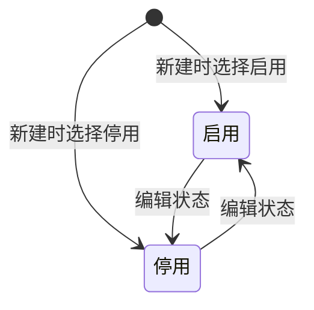

# 采购主体-全局说明

### 状态变更

### 状态与操作对照

| 状态 | 可执行的操作 |
| --- | --- |
| 启用 | 详情、编辑 |
| 停用 | 详情、编辑 |

### 通用规则

采购主体用于维护采购业务中签约、付款、报关等场景使用的主体公司信息，原型中包含主体基础信息、印章附件、状态、收款账户信息。
状态枚举为「启用」「停用」。
列表样例均展示「启用」，新建和编辑弹窗均展示「启用」「停用」单选项，默认选中值待确认。
【公司名称】【公司英文名称】【简称】【统一社会信用代码】为采购主体识别关键字段。
【区域范围】原型列表样例包含「境内」「境外」，完整枚举待确认。
【国家】【省/市/县】【注册地】【海关代码】与报关、贸易国或地区取值有关，其中【注册地】旁提示为“用于生成报关单的贸易国(地区)字段”。
【公章】【合同章】【财务章】【法人章】【联系人章】用于采购主体相关文件用章资料留存，是否被合同生成或采购单打印引用待确认。
【收款账户】在新建弹窗中维护，是否允许在编辑弹窗维护待确认。
采购单、合同模板或采购合同引用采购主体后的字段变更限制待确认，至少需要确认【公司名称】【公司英文名称】【统一社会信用代码】【状态】【收款账户】被引用后的可编辑范围。
当采购主体状态为「停用」时，是否允许被新采购单、合同或付款信息继续选择待确认。
原型未展示采购主体删除入口，采购主体删除不在当前已确认范围内。
原型未展示列表导出入口，导出采购主体列表不在当前已确认范围内。
