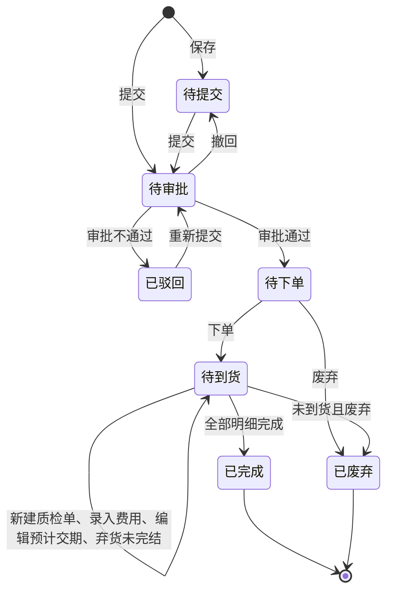

# 采购单-全局说明

### 状态变更

### 状态与操作对照

| 状态 | 可执行的操作 | 原型依据/说明 |
| --- | --- | --- |
| 所有状态 | 详情、编辑备注 | 列表操作说明展示「所有状态-详情」；备注鼠标移入展示并支持编辑 |
| 待提交 | 编辑、删除、提交 | 列表操作说明展示「待提交&已驳回」可编辑、删除、提交 |
| 已驳回 | 编辑、删除、提交 | 审批不通过后进入「已驳回」，可重新编辑提交 |
| 待审批 | 审批、撤回 | 审批流未被第一个审批人审批前允许撤回；列表操作说明展示「审批」 |
| 待下单 | 下单、打印合同、废弃 | 下单后状态变更为「待到货」 |
| 待到货 | 打印合同、采购变更入口、弃货、废弃、新建产品质检单、录入费用单 | 采购变更单自身 PRD 不在本目录展开 |
| 已完成 | - | 全部采购单明细完成后整单完成 |
| 已废弃 | - | 原型脚本中出现「已作废」枚举，列表页展示为「已废弃」，状态命名待确认统一 |

### 通用规则

【采购单号】系统自动生成，规则为「CGD」+ 年月日 + 三位当天序列号，序列号跨日清 0 后从 1 开始，例如「CGD240101001」「CGD240102001」
【采购总金额】按【货款金额】+【费用单金额】计算，原型说明中称为「采购单内货款的总金额+其他费用」
【货款金额】按采购单明细 SKU 的所有含税金额汇总
【费用单金额】按采购单关联费用单金额汇总，费用单自身审批与状态流不在本目录展开
【扣款单金额】列表存在字段，计算口径待确认
【成本调整金额】列表存在字段，计算口径待确认
【退货金额】按已完成退货单的退货金额汇总，退货单自身 PRD 不在本目录展开
【弃货金额】按手动完结采购单部分的货款金额汇总
【原币转本币汇率】按采购单创建时间取成本配置中的浮动汇率，例如原币为美元时取美元兑换人民币汇率
【不含税单价(本币)】按【不含税单价(原币)】×【原币转本币汇率】计算
【含税单价(本币)】按【含税单价(原币)】×【原币转本币汇率】计算
【总含税金额(原币)】按【含税单价(原币)】×【采购量】计算
【总含税金额(本币)】按【含税单价(本币)】×【采购量】计算
【采购产品数】按采购单内 SKU 明细去重计数
【入库量】按采购单关联且状态为「已入库」的入库单明细数量汇总
【待质检量】按采购单关联且状态为「待质检」「待审批」「已驳回」的质检单明细数量汇总
【待转单量】按采购单关联且状态为「待提交」「待审批」「已驳回」「待变更」的采购变更单明细数量汇总
【退货量】按采购单关联且状态为「已完成」的退货单明细数量汇总
【弃货量】按手动完结采购单明细部分的数量汇总
【剩余订单量】按【采购量】+【退货量】-【入库量】-【待质检量】-【待转单量】计算
【逾期天数】当采购单没有任何非废弃入库单时，按当前时间-【预计交期】计算；结果小于 0 不逾期，结果大于等于 1 展示逾期天数标识
【逾期天数】当采购单已有非废弃入库单时，按最早入库单的入库时间-【预计交期】计算；结果小于 0 不逾期，结果大于等于 1 展示逾期天数标识
【采购标签】可包含「数量更改」「超过货期要求」「高价订单」，一张采购单只要存在任一标签即需要审批
【数量更改】当采购计划或新品请购生成采购单后采购数量被修改时生成
【超过货期要求】提交采购单时，按【预计交期】-提交时间与供应商【预计采购交期】比较，超过时生成；具体天数口径待确认
【高价订单】当采购单明细单价不是该 SKU 全部供应商最低价时生成

### 上下游联动

审批通过后，当【结算方式】为「现结」时，按采购单维度在请款池-采购单现结中生成一条数据；请款池自身流程不在本目录展开
审批通过后，当【预付比例】>0 时，按采购单维度在请款池-预付单中生成一条数据；请款池自身流程不在本目录展开
质检完成生成入库单时，系统判断采购单明细的【待质检量】和【剩余订单量】是否为 0；为 0 时将明细标记为已完成
弃货结束到货时，系统判断采购单明细的【待质检量】【剩余订单量】【待转单量】是否全部为 0；全部为 0 时将明细标记为已完成
当一张采购单的全部明细均为已完成时，采购单状态变更为「已完成」
若 SKU 的 MSKU 已产生采购单，则产品库不允许删除该 MSKU，提示「该产品已生成采购单，无法删除」

### 不在范围内

不生成采购变更单自身的新建、编辑、审批、详情 PRD；采购单中仅记录「采购变更」入口和前置校验
不生成供应商、供货关系、仓库、库存、入库、退货、报价单模块 PRD
费用单、扣款单、质检单、请款池的自身状态流、审批流、列表和详情由对应模块确认，本目录仅记录采购单入口和采购单侧回写规则
