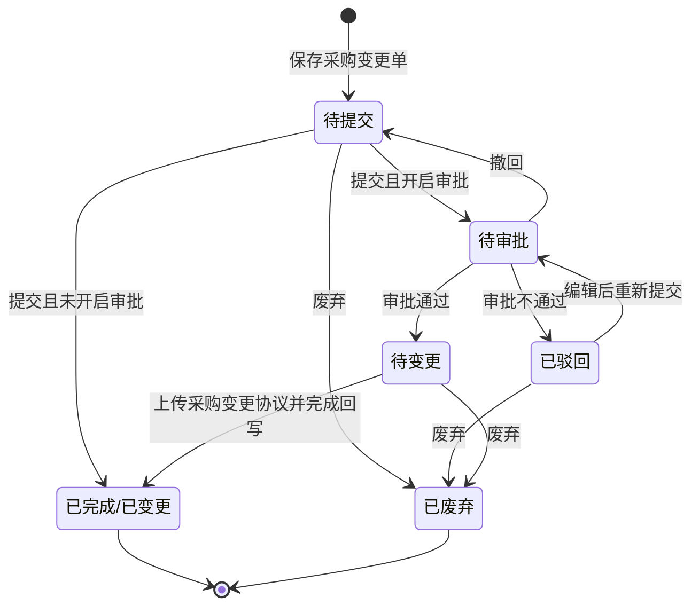

# 采购变更单-全局说明

### 状态变更

### 状态与操作对照

| 状态 | 可执行的操作 |
| --- | --- |
| 所有状态 | 详情 |
| 待提交 | 编辑、提交、废弃 |
| 待审批 | 审批、撤回 |
| 待变更 | 上传采购变更协议、废弃 |
| 已驳回 | 编辑、提交、废弃 |
| 已完成/已变更 | 导出采购变更协议 |
| 已废弃 | - |

### 通用规则

状态枚举以采购变更单列表页签为准，原型中列表页签展示「已完成」，状态面板标识出现「已变更」，最终枚举名称待确认。
采购变更单号规则为「POC+YYMMDD+三位日序列号」，日序列号跨日刷新，示例「POC250701001」。
采购变更单必须引用采购单，采购单号、供应商编号、采购员、采购合同、币种、乙方收款账号、预计交期、变更备注从采购单或新建编辑页取值。
变更备注作为本次变更原因/说明，原型未单独展示「变更原因」字段。
采购变更单支持价格变更和转单量变更，保存/提交时必须存在至少一项变更。
含税单价支持变更；当采购明细【入库量】+【待质检量】>0 时，【含税单价】前端置灰不可编辑。
【总含税金额】以明细【含税单价】和【采购量】计算或展示，转单明细允许修改【总含税金额】。
采购变更单版本号挂在采购单上，默认从0开始；每次新建采购变更单按采购单版本号+1传值，新建成功后采购单版本号更新；新增、删除、废弃后版本号不回退。
采购变更单保存/提交成功后，需要更新采购单明细【待转单量】和【剩余订单量】，用于锁定准备转单的数量，防止被其他业务使用。
存在总价格变动且采购单结算方式为「现结」时，需要为对应应付单打上禁止请款标识；变更完成或废弃后按规则移除或刷新。
审批通过不直接完成采购单回写；开启审批时，审批通过后进入「待变更」，待上传采购变更协议后完成回写。
未开启审批时提交后状态直接进入「已变更」，是否仍需要上传采购变更协议待确认。
采购变更协议导出时，只展示发生变更的数据；原型说明按 Modelnumber 维度过滤数量和含税单价均无变更的明细。

### 不在范围内

不生成采购单、质检单、入库单、弃货、调柜单、请款池、供货关系、供应商、报价单等模块 PRD。
仅记录采购变更单对采购单明细、应付单、供货关系报价等对象的影响，不展开被影响模块自身功能。
